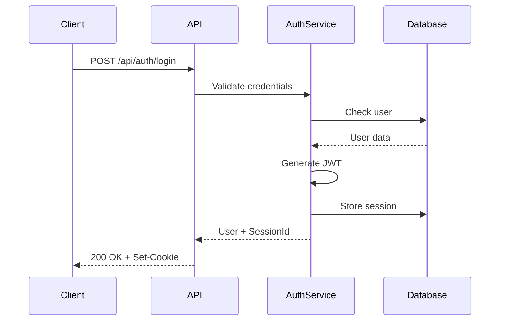

# Authentication & Authorization Guide

**Last Updated**: November 6, 2025
**Status**: Session-based authentication only (simplified October 2025)

## Overview

The Veritable Games platform uses session-based authentication for user login and access control. The platform previously supported TOTP and WebAuthn but these were removed in October 2025 to simplify the authentication system.

## Authentication Methods

### Current Method: Session-Based Authentication

**Active**: This is the only authentication method currently supported.

The platform uses JWT tokens stored in HTTP-only cookies for session management.

#### Login Flow



#### Implementation

**Login Request:**
```javascript
const loginResponse = await fetch('/api/auth/login', {
  method: 'POST',
  headers: {
    'Content-Type': 'application/json'
  },
  credentials: 'include', // Important: Include cookies
  body: JSON.stringify({
    username: 'user@example.com',
    password: 'securePassword123'
  })
});

if (loginResponse.ok) {
  const result = await loginResponse.json();
  console.log('Logged in as:', result.data.user);
  // Session cookie is automatically stored
}
```

**Session Cookie Structure:**
```
Name: sessionId
Value: eyJhbGciOiJIUzI1NiIsInR5cCI6IkpXVCJ9...
HttpOnly: true
Secure: true (in production)
SameSite: Strict
Path: /
MaxAge: 604800 (7 days)
```

#### Logout Flow

```javascript
const logoutResponse = await fetch('/api/auth/logout', {
  method: 'POST',
  headers: {
    'X-CSRF-Token': csrfToken // Required for state change
  },
  credentials: 'include'
});

if (logoutResponse.ok) {
  // Session cleared, redirect to login
  window.location.href = '/login';
}
```

### 2. Two-Factor Authentication (TOTP) - ❌ REMOVED (October 2025)

**Status**: This feature was removed in October 2025 to simplify authentication.

**Historical information below** - archived for reference:

#### Setup Flow

1. **Generate Secret:**
```javascript
const setupResponse = await fetch('/api/auth/totp/setup', {
  method: 'POST',
  headers: {
    'X-CSRF-Token': csrfToken
  },
  credentials: 'include'
});

const { secret, qrCode, backupCodes } = setupResponse.json().data;
// Display QR code for scanning with authenticator app
```

2. **Verify Setup:**
```javascript
const verifyResponse = await fetch('/api/auth/totp/verify', {
  method: 'POST',
  headers: {
    'Content-Type': 'application/json',
    'X-CSRF-Token': csrfToken
  },
  credentials: 'include',
  body: JSON.stringify({
    token: '123456' // 6-digit code from authenticator
  })
});
```

#### Login with TOTP

```javascript
// After initial login
if (result.data.requiresTOTP) {
  const totpCode = prompt('Enter 2FA code:');

  const totpResponse = await fetch('/api/auth/totp/verify', {
    method: 'POST',
    headers: {
      'Content-Type': 'application/json',
      'X-CSRF-Token': csrfToken
    },
    credentials: 'include',
    body: JSON.stringify({
      token: totpCode
    })
  });

  if (totpResponse.ok) {
    // Full authentication complete
  }
}
```

### 3. WebAuthn (Passwordless) - ❌ REMOVED (October 2025)

**Status**: This feature was removed in October 2025 to simplify authentication.

**Historical information below** - archived for reference:

#### Registration Flow

1. **Begin Registration:**
```javascript
const beginResponse = await fetch('/api/auth/webauthn/register/begin', {
  method: 'POST',
  headers: {
    'X-CSRF-Token': csrfToken
  },
  credentials: 'include'
});

const options = await beginResponse.json();
```

2. **Create Credential:**
```javascript
const credential = await navigator.credentials.create(options.data);
```

3. **Finish Registration:**
```javascript
const finishResponse = await fetch('/api/auth/webauthn/register/finish', {
  method: 'POST',
  headers: {
    'Content-Type': 'application/json',
    'X-CSRF-Token': csrfToken
  },
  credentials: 'include',
  body: JSON.stringify(credential)
});
```

#### Authentication Flow

```javascript
// Begin authentication
const beginResponse = await fetch('/api/auth/webauthn/authenticate/begin', {
  method: 'POST',
  credentials: 'include'
});

const options = await beginResponse.json();

// Get credential
const assertion = await navigator.credentials.get(options.data);

// Complete authentication
const finishResponse = await fetch('/api/auth/webauthn/authenticate/finish', {
  method: 'POST',
  headers: {
    'Content-Type': 'application/json'
  },
  credentials: 'include',
  body: JSON.stringify(assertion)
});
```

## CSRF Protection

All state-changing requests require a CSRF token to prevent cross-site request forgery attacks.

### Obtaining CSRF Token

```javascript
const tokenResponse = await fetch('/api/auth/csrf-token', {
  credentials: 'include'
});

const { csrfToken, csrfSecret } = await tokenResponse.json().data;

// Store for use in requests
sessionStorage.setItem('csrfToken', csrfToken);
sessionStorage.setItem('csrfSecret', csrfSecret);
```

### Using CSRF Token

Include the token in the `X-CSRF-Token` header:

```javascript
fetch('/api/forums/topics', {
  method: 'POST',
  headers: {
    'Content-Type': 'application/json',
    'X-CSRF-Token': sessionStorage.getItem('csrfToken')
  },
  credentials: 'include',
  body: JSON.stringify(data)
});
```

### Token Validation

The server validates CSRF tokens with session binding:

```typescript
// Server-side validation
const verification = csrfManager.verifyToken(
  csrfToken,
  csrfSecret,
  sessionId
);

if (!verification.valid) {
  return new Response('CSRF validation failed', { status: 403 });
}
```

## Authorization

### User Roles

| Role | Description | Permissions |
|------|-------------|-------------|
| **user** | Standard user | Create content, edit own content |
| **moderator** | Community moderator | Edit/delete content, manage users |
| **admin** | Administrator | Full content control, system settings |
| **super_admin** | Super Administrator | Complete system access |

### Permission Checks

```javascript
// Client-side check (for UI only)
const canEdit = (user, resource) => {
  return user.id === resource.author_id ||
         ['moderator', 'admin', 'super_admin'].includes(user.role);
};

// Server-side enforcement
if (!canUserEdit(currentUser, resource)) {
  return new Response('Forbidden', { status: 403 });
}
```

## Session Management

### Session Storage

Sessions are stored in the database with the following structure:

```sql
CREATE TABLE sessions (
  id TEXT PRIMARY KEY,
  user_id TEXT NOT NULL,
  data TEXT, -- JSON session data
  expires_at INTEGER NOT NULL,
  created_at INTEGER DEFAULT (unixepoch()),
  last_activity INTEGER DEFAULT (unixepoch()),
  ip_address TEXT,
  user_agent TEXT
);
```

### Session Lifecycle

1. **Creation**: On successful login
2. **Validation**: On each authenticated request
3. **Refresh**: Activity updates `last_activity`
4. **Expiration**: After 7 days or manual logout

### Getting Current User

```javascript
const response = await fetch('/api/auth/me', {
  credentials: 'include'
});

if (response.ok) {
  const { user } = await response.json().data;
  console.log('Current user:', user);
} else if (response.status === 401) {
  // Not authenticated, redirect to login
  window.location.href = '/login';
}
```

## Security Middleware

The `withSecurity` wrapper provides comprehensive protection:

```typescript
export const POST = withSecurity(handler, {
  csrfEnabled: true,      // Require CSRF token
  requireAuth: true,      // Require authentication
  requireRole: 'admin',   // Require specific role
  rateLimitConfig: 'api', // Apply rate limiting
  cspEnabled: true        // Content Security Policy
});
```

### Middleware Configuration Options

| Option | Type | Default | Description |
|--------|------|---------|-------------|
| `csrfEnabled` | boolean | true | Enable CSRF protection |
| `requireAuth` | boolean | false | Require authentication |
| `requireRole` | string | - | Require specific role |
| `rateLimitConfig` | string | 'api' | Rate limit tier |
| `cspEnabled` | boolean | true | Enable CSP headers |

## Best Practices

### 1. Always Include Credentials

```javascript
// Correct
fetch('/api/endpoint', {
  credentials: 'include' // Include cookies
});

// Incorrect
fetch('/api/endpoint'); // No cookies sent
```

### 2. Handle Authentication Errors

```javascript
async function authenticatedFetch(url, options = {}) {
  const response = await fetch(url, {
    ...options,
    credentials: 'include'
  });

  if (response.status === 401) {
    // Session expired, redirect to login
    window.location.href = '/login';
    return;
  }

  return response;
}
```

### 3. Refresh CSRF Tokens

```javascript
// Refresh token on 403 errors
if (response.status === 403) {
  const tokenResponse = await fetch('/api/auth/csrf-token', {
    credentials: 'include'
  });

  if (tokenResponse.ok) {
    const { csrfToken } = await tokenResponse.json().data;
    // Retry request with new token
  }
}
```

### 4. Implement Session Timeout Warning

```javascript
let warningTimer;
let logoutTimer;

function resetTimers() {
  clearTimeout(warningTimer);
  clearTimeout(logoutTimer);

  // Warn 5 minutes before expiry
  warningTimer = setTimeout(() => {
    if (confirm('Session expiring soon. Stay logged in?')) {
      fetch('/api/auth/refresh', {
        method: 'POST',
        credentials: 'include'
      });
    }
  }, 25 * 60 * 1000); // 25 minutes

  // Auto logout after 30 minutes
  logoutTimer = setTimeout(() => {
    window.location.href = '/logout';
  }, 30 * 60 * 1000);
}

// Reset on user activity
document.addEventListener('click', resetTimers);
document.addEventListener('keypress', resetTimers);
```

## Testing Authentication

### Unit Tests

```javascript
describe('Authentication', () => {
  test('successful login', async () => {
    const response = await request(app)
      .post('/api/auth/login')
      .send({
        username: 'test',
        password: 'test123'
      });

    expect(response.status).toBe(200);
    expect(response.body.success).toBe(true);
    expect(response.headers['set-cookie']).toBeDefined();
  });

  test('invalid credentials', async () => {
    const response = await request(app)
      .post('/api/auth/login')
      .send({
        username: 'test',
        password: 'wrong'
      });

    expect(response.status).toBe(401);
    expect(response.body.success).toBe(false);
  });
});
```

### E2E Tests

```javascript
test('complete authentication flow', async ({ page }) => {
  // Navigate to login
  await page.goto('/login');

  // Fill credentials
  await page.fill('[name="username"]', 'test@example.com');
  await page.fill('[name="password"]', 'test123');

  // Submit form
  await page.click('[type="submit"]');

  // Verify redirect to dashboard
  await page.waitForURL('/dashboard');

  // Verify user info displayed
  await expect(page.locator('.user-name')).toContainText('Test User');
});
```

## Troubleshooting

### Common Issues

1. **"Authentication required" on protected routes**
   - Ensure cookies are included: `credentials: 'include'`
   - Check session hasn't expired
   - Verify cookie domain matches

2. **"CSRF validation failed"**
   - Obtain fresh CSRF token
   - Include token in `X-CSRF-Token` header
   - Ensure token matches session

3. **"Session expired"**
   - Re-authenticate user
   - Implement automatic refresh
   - Handle 401 responses gracefully

4. **Cookies not being set**
   - Check SameSite settings
   - Verify HTTPS in production
   - Ensure correct domain/path

## Security Considerations

1. **Password Requirements**
   - Minimum 8 characters
   - Mix of letters, numbers, symbols
   - Password strength meter
   - Breach detection via HaveIBeenPwned

2. **Session Security**
   - HTTP-only cookies prevent XSS
   - Secure flag for HTTPS
   - SameSite=Strict prevents CSRF
   - Regular session rotation

3. **Rate Limiting**
   - Auth endpoints: 5 attempts per 15 minutes
   - Exponential backoff on failures
   - IP-based tracking
   - Account lockout after repeated failures

4. **Additional Protections**
   - Content Security Policy
   - SQL injection prevention
   - XSS protection with DOMPurify
   - Secure password hashing (bcrypt)