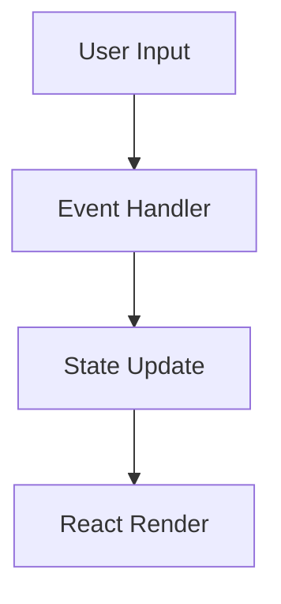

# Workspace Architecture Diagrams

This directory contains visual architecture diagrams created in Mermaid syntax to support the comprehensive workspace comparison documentation.

## Diagrams Overview

| Diagram | File | Purpose | Related Document |
|---------|------|---------|------------------|
| **Three-Layer State Architecture** | [state-architecture.md](./state-architecture.md) | Shows Yjs → Zustand → PostgreSQL data flow | [Technical Comparison](../workspace-technical-comparison-feb-2026.md#3-state-management-patterns) |
| **Rendering Pipeline Comparison** | [rendering-pipeline.md](./rendering-pipeline.md) | Compares DOM vs Canvas vs WebGL rendering approaches | [Technical Comparison](../workspace-technical-comparison-feb-2026.md#2-rendering-architecture-deep-dive) |
| **Hybrid Canvas Architecture** | [hybrid-canvas-architecture.md](./hybrid-canvas-architecture.md) | Proposed hybrid DOM+Canvas rendering system | [Technical Comparison](../workspace-technical-comparison-feb-2026.md#9-strategic-recommendations) |
| **Component Decomposition** | [component-decomposition.md](./component-decomposition.md) | God component refactoring strategy | [Technical Comparison](../workspace-technical-comparison-feb-2026.md#5-component-architecture) |

## Viewing the Diagrams

### Option 1: GitHub (Recommended)
Simply open the `.md` files on GitHub. GitHub natively renders Mermaid diagrams in markdown files.

**Example**: Navigate to this directory on GitHub and click any diagram file.

### Option 2: VS Code with Mermaid Extension
1. Install extension: [Markdown Preview Mermaid Support](https://marketplace.visualstudio.com/items?itemName=bierner.markdown-mermaid)
2. Open any diagram `.md` file
3. Press `Ctrl+Shift+V` (Windows/Linux) or `Cmd+Shift+V` (Mac) for preview

### Option 3: Mermaid Live Editor
1. Visit [mermaid.live](https://mermaid.live)
2. Copy diagram code from any `.md` file (between ` ```mermaid` and ` ``` `)
3. Paste into editor to view and export as PNG/SVG

### Option 4: Command Line (Generate PNG)
```bash
# Install Mermaid CLI
npm install -g @mermaid-js/mermaid-cli

# Generate PNG from diagram
cd /home/user/Projects/veritable-games-main/docs/architecture/diagrams
mmdc -i state-architecture.md -o state-architecture.png
mmdc -i rendering-pipeline.md -o rendering-pipeline.png
mmdc -i hybrid-canvas-architecture.md -o hybrid-canvas-architecture.png
mmdc -i component-decomposition.md -o component-decomposition.png
```

## Diagram Syntax (Mermaid)

All diagrams use [Mermaid](https://mermaid.js.org/) syntax, a text-based diagramming language.

**Common Diagram Types Used**:
- `graph TB` / `graph LR` - Flowcharts (top-bottom or left-right)
- `sequenceDiagram` - Sequence diagrams for interactions
- `stateDiagram-v2` - State machines
- `gantt` - Timeline/Gantt charts

**Example**:


## Creating New Diagrams

When adding new architecture diagrams to this directory:

1. **Use consistent formatting**:
   - Title at top
   - Brief description
   - Mermaid diagram in code block
   - Key characteristics/notes section
   - References section

2. **Color conventions**:
   - `#4a5568` (gray) - Neutral components
   - `#48bb78` (green) - Optimal/recommended
   - `#e53e3e` (red) - Problems/bottlenecks
   - `#ecc94b` (yellow) - In progress/partial
   - `#4299e1` (blue) - Informational

3. **File naming**:
   - Use kebab-case: `my-diagram-name.md`
   - Be descriptive: `state-architecture.md` not `diagram1.md`

4. **Update this README**:
   - Add entry to diagrams overview table
   - Link to related documentation

## Related Documentation

- **Main Analysis Documents**:
  - [UI/UX Competitive Analysis](/docs/analysis/workspace-ui-ux-competitive-analysis-feb-2026.md)
  - [Feature Capability Matrix](/docs/analysis/workspace-feature-capability-matrix-feb-2026.md)
  - [Technical Architecture Comparison](/docs/architecture/workspace-technical-comparison-feb-2026.md)

- **Implementation Plans**:
  - Approved plan: `/home/user/.claude/plans/bright-moseying-hare.md`

- **Historical Context**:
  - [Workspace Comprehensive Analysis Nov 2025](/docs/features/WORKSPACE_COMPREHENSIVE_ANALYSIS_NOV_2025.md)
  - [Excalidraw/Miro UI Research Feb 2026](/docs/completed/feb-2026/excalidraw-miro-ui-research-feb-13-2026.md)

## Technical References

| Component | File | Lines | Notes |
|-----------|------|-------|-------|
| Main Canvas | `/frontend/src/components/workspace/WorkspaceCanvas.tsx` | 1,741 | **God component** - needs decomposition |
| State Store | `/frontend/src/stores/workspace.ts` | 1,886 | Three-layer architecture |
| Yjs Setup | `/frontend/src/lib/workspace/yjs-setup.ts` | ~200 | CRDT configuration |
| Viewport Culling | `/frontend/src/lib/workspace/viewport-culling.ts` | ~150 | Performance optimization |
| WebSocket Server | `/frontend/server/websocket-server.ts` | ~300 | Real-time sync (deployed Nov 30, 2025) |

## Diagram Maintenance

These diagrams should be updated when:
- Architecture changes (state management, rendering approach)
- Component structure refactoring
- Performance optimization strategies
- New collaboration features

**Last Updated**: February 14, 2026
**Created By**: Claude Code (automated documentation generation)
**Status**: ✅ Complete (4/4 diagrams)
