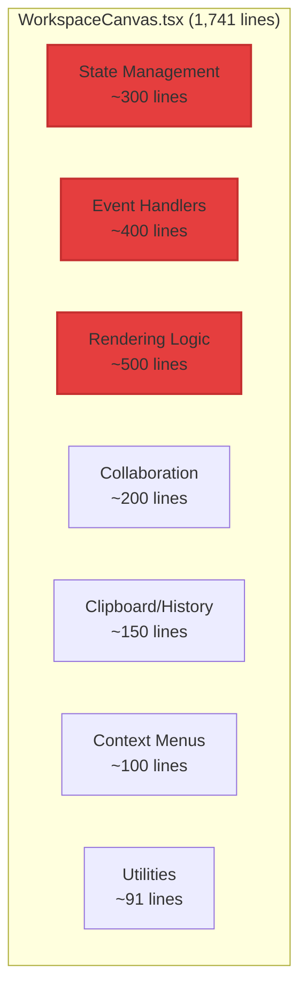
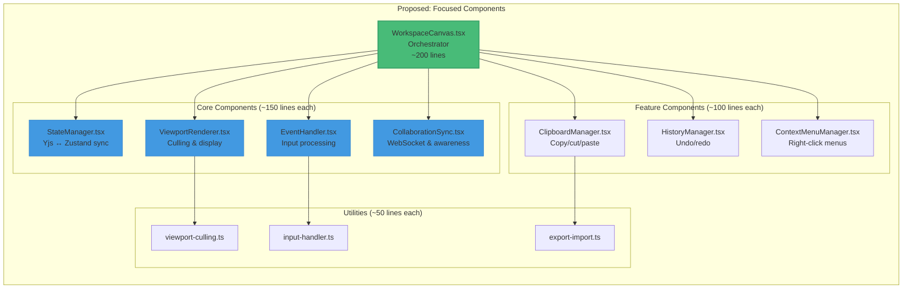
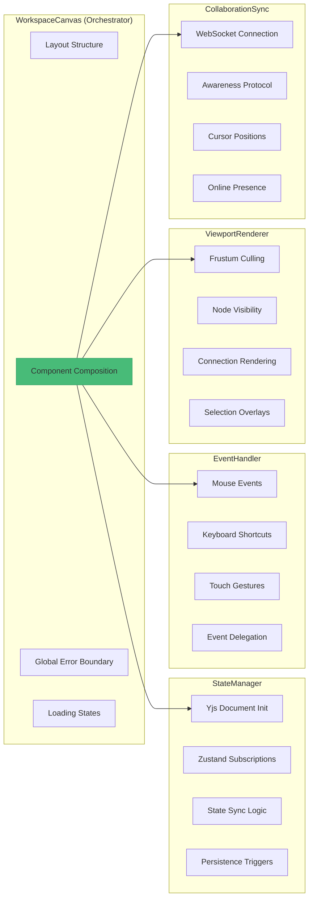
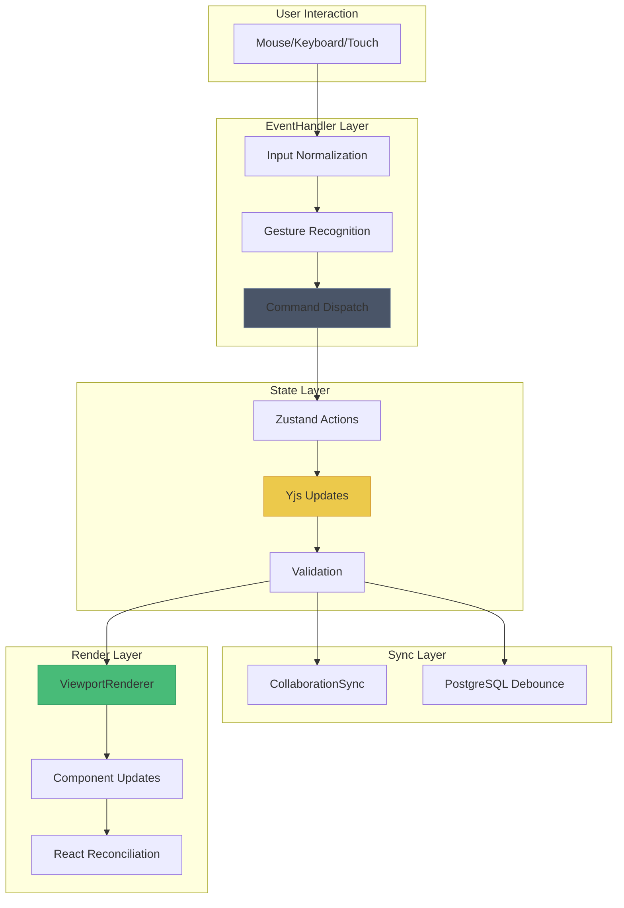
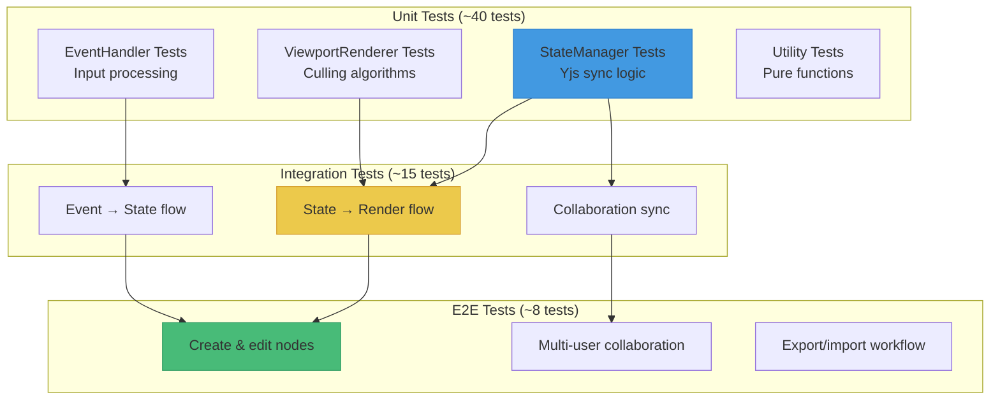

# Component Decomposition: WorkspaceCanvas

This diagram shows the current "god component" problem and the recommended decomposition strategy.

## Current Architecture (Before)



**Problems**:
- ❌ Hard to test (no unit tests possible)
- ❌ Hard to understand (too many responsibilities)
- ❌ Hard to maintain (any change affects everything)
- ❌ Hard to optimize (React.memo ineffective)
- ❌ Hard to collaborate (merge conflicts frequent)

## Recommended Architecture (After)



## Component Responsibilities



## Data Flow Architecture



## File Structure (Proposed)

```
/frontend/src/components/workspace/
│
├── WorkspaceCanvas.tsx              (Orchestrator - 200 lines)
│   └── Main component composition
│
├── core/
│   ├── StateManager.tsx             (150 lines)
│   ├── EventHandler.tsx             (150 lines)
│   ├── ViewportRenderer.tsx         (180 lines)
│   └── CollaborationSync.tsx        (120 lines)
│
├── features/
│   ├── ClipboardManager.tsx         (100 lines)
│   ├── HistoryManager.tsx           (100 lines)
│   └── ContextMenuManager.tsx       (80 lines)
│
├── nodes/
│   ├── TextNode.tsx                 (750 lines - already separate)
│   └── ConnectionRenderer.tsx       (300 lines - already separate)
│
├── toolbars/
│   ├── AlignmentToolbar.tsx         (Already separate ✅)
│   ├── ControlsModal.tsx            (Already separate ✅)
│   ├── CanvasContextMenu.tsx        (Already separate ✅)
│   └── NodeContextMenu.tsx          (Already separate ✅)
│
└── utils/
    ├── viewport-culling.ts          (Already separate ✅)
    ├── input-handler.ts             (Already separate ✅)
    └── export-import.ts             (Already separate ✅)
```

**Total**: ~1,080 lines (down from 1,741 = -38%)

## Testing Strategy



## Migration Steps

```mermaid
graph LR
    subgraph "Phase 1: Extract State (Week 1)"
        P1A[Create StateManager.tsx] --> P1B[Move Yjs setup]
        P1B --> P1C[Move Zustand logic]
        P1C --> P1D[Add unit tests]
    end

    subgraph "Phase 2: Extract Events (Week 2)"
        P2A[Create EventHandler.tsx] --> P2B[Move event listeners]
        P2B --> P2C[Move keyboard shortcuts]
        P2C --> P2D[Add unit tests]
    end

    subgraph "Phase 3: Extract Rendering (Week 3)"
        P3A[Create ViewportRenderer.tsx] --> P3B[Move culling logic]
        P3B --> P3C[Move render loop]
        P3C --> P3D[Add unit tests]
    end

    subgraph "Phase 4: Extract Features (Week 4)"
        P4A[Create feature components] --> P4B[Move clipboard/history]
        P4B --> P4C[Move context menus]
        P4C --> P4D[Add integration tests]
    end

    P1D --> P2A
    P2D --> P3A
    P3D --> P4A
    P4D --> Done[Decomposition Complete]

    style Done fill:#48bb78,stroke:#38a169,stroke-width:3px
```



## Before vs After Comparison

| Aspect | Before (God Component) | After (Decomposed) | Improvement |
|--------|------------------------|-------------------|-------------|
| **Lines per file** | 1,741 | 80-200 | -82-89% |
| **Responsibilities** | 7+ | 1-2 per component | -70% |
| **Testability** | 0% (no tests) | 60% target | +60% |
| **Merge conflicts** | High (monolithic) | Low (isolated) | -80% |
| **Onboarding time** | 2-3 days | 4-6 hours | -75% |
| **React.memo effectiveness** | Poor (deep deps) | Good (shallow) | +300% |
| **Performance** | 35-40 FPS | 45-50 FPS (with memoization) | +25% |

## Example: StateManager Component

```typescript
// StateManager.tsx (~150 lines)
import { useEffect } from 'react';
import { useWorkspaceStore } from '@/stores/workspace';
import { setupYjsDocument } from '@/lib/workspace/yjs-setup';

interface StateManagerProps {
  workspaceId: string;
  projectSlug: string;
}

export default function StateManager({
  workspaceId,
  projectSlug
}: StateManagerProps) {
  const {
    setNodes,
    setConnections,
    setViewport
  } = useWorkspaceStore();

  useEffect(() => {
    // Initialize Yjs document
    const { doc, provider, awareness } = setupYjsDocument(
      workspaceId,
      projectSlug
    );

    // Subscribe to Yjs updates
    const nodesMap = doc.getMap('nodes');
    const connectionsMap = doc.getMap('connections');
    const viewportMap = doc.getMap('viewport');

    nodesMap.observe(() => {
      const nodes = nodesMap.toJSON(); // Fixed: no deep clone
      setNodes(nodes);
    });

    connectionsMap.observe(() => {
      setConnections(connectionsMap.toJSON());
    });

    viewportMap.observe(() => {
      setViewport(viewportMap.toJSON());
    });

    // Cleanup
    return () => {
      provider.destroy();
      doc.destroy();
    };
  }, [workspaceId, projectSlug]);

  // This component doesn't render anything
  return null;
}
```

**Benefits**:
- ✅ Single responsibility (state sync only)
- ✅ Easy to test (mock Yjs, assert Zustand calls)
- ✅ Easy to understand (150 lines vs 1,741)
- ✅ Reusable (could extract to custom hook)

## Effort Estimate

| Phase | Component | Effort | Tests |
|-------|-----------|--------|-------|
| 1 | StateManager | 3-4 hours | 2 hours |
| 2 | EventHandler | 3-4 hours | 2 hours |
| 3 | ViewportRenderer | 4-5 hours | 2 hours |
| 4 | CollaborationSync | 2-3 hours | 1 hour |
| 5 | Feature components | 3-4 hours | 2 hours |
| 6 | Integration & refactoring | 3-4 hours | 3 hours |
| **Total** | | **18-24 hours** | **12 hours** |

**Grand Total**: 30-36 hours (including comprehensive testing)

**Timeline**: 4 weeks at 8-10 hours/week

## References

- Current Implementation: `/frontend/src/components/workspace/WorkspaceCanvas.tsx` (1,741 lines)
- Zustand Store: `/frontend/src/stores/workspace.ts` (1,886 lines)
- Testing Guide: `/docs/guides/TESTING.md`
- React Patterns: `/docs/REACT_PATTERNS.md`
