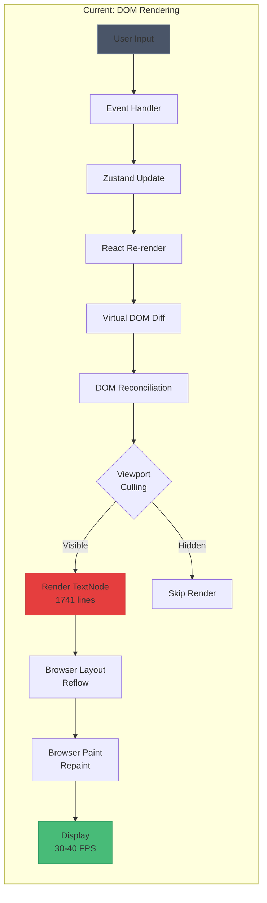
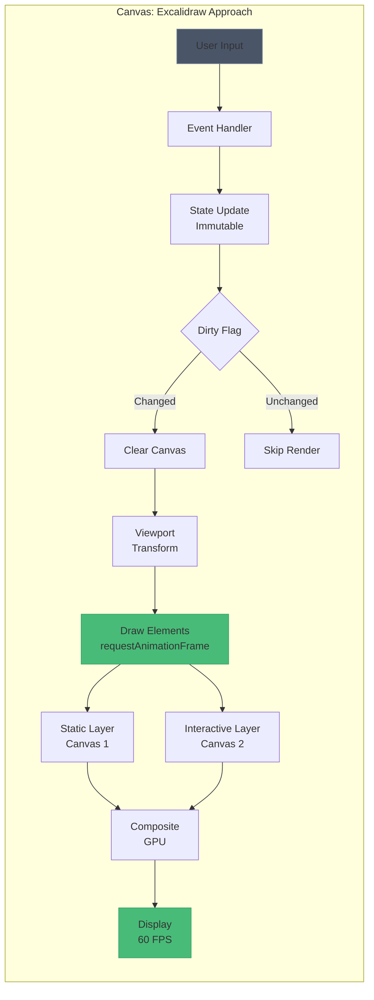
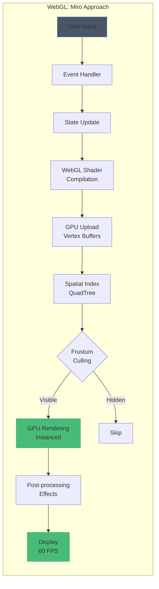
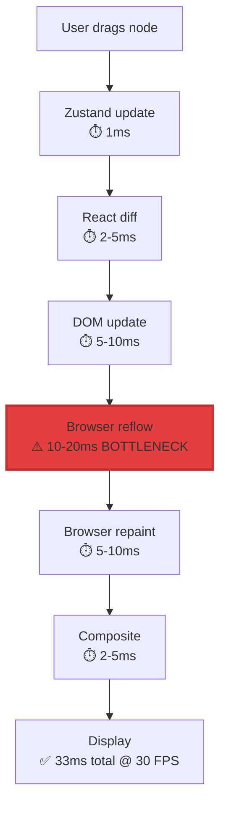
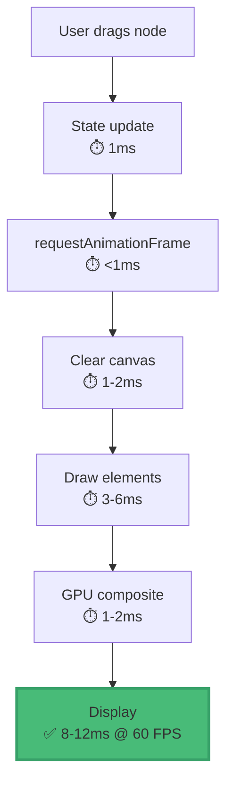
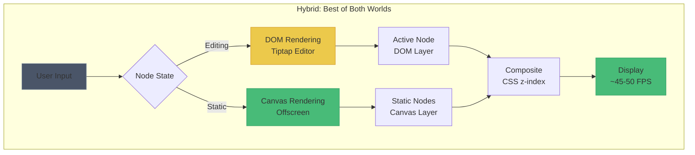

# Rendering Pipeline Comparison

This diagram compares three rendering approaches: DOM (Veritable current), Canvas (Excalidraw), and WebGL (Miro).

## Veritable (DOM-Based Rendering)

**Performance**: 30-40 FPS at 1000 nodes
**Pros**: Tiptap rich text, CSS styling, accessibility
**Cons**: Performance ceiling, expensive reflows, memory intensive

## Excalidraw (Canvas-Based Rendering)

**Performance**: 60 FPS with 1000s of elements
**Pros**: Low memory, smooth animations, GPU-accelerated
**Cons**: Custom text editing, no CSS, accessibility challenging

## Miro (WebGL-Based Rendering)

**Performance**: 60 FPS with 10,000+ elements
**Pros**: Massive scale, GPU acceleration, smooth effects
**Cons**: Complex implementation, large bundle size, WebGL expertise required

## Performance Comparison

| Metric | DOM (Veritable) | Canvas (Excalidraw) | WebGL (Miro) |
|--------|-----------------|---------------------|--------------|
| **Max Elements (60 FPS)** | 500-800 | 5,000-10,000 | 50,000+ |
| **Memory (1000 nodes)** | 150-200 MB | 50-80 MB | 80-120 MB |
| **Initial Render** | 200-500ms | 50-100ms | 100-300ms |
| **Text Editing** | Native (Tiptap) | Custom | Custom |
| **Accessibility** | Excellent | Moderate | Poor |
| **Bundle Size** | 450 KB | 280 KB | 850 KB |

## Bottleneck Analysis

### DOM Rendering (Current)

**Critical Bottleneck**: Browser reflow (10-20ms) limits frame time budget

### Canvas Rendering (Proposed)

**No Bottleneck**: Entire pipeline fits within 16ms frame budget

## Recommended Hybrid Approach

**Expected Performance**: 45-50 FPS at 1000 nodes (2-3x improvement)
**Effort**: 40-50 hours
**Pros**: Keep Tiptap, improve performance, moderate complexity
**Cons**: Two rendering systems to maintain

## References

- Current Implementation: `/frontend/src/components/workspace/WorkspaceCanvas.tsx` (1,741 lines)
- Viewport Culling: `/frontend/src/lib/workspace/viewport-culling.ts`
- Performance Tests: `/docs/completed/feb-2026/workspace-performance-tests-feb-14-2026.md`
