# Three-Layer State Architecture

This diagram shows Veritable's three-layer state management architecture for workspace data flow.

```mermaid
graph TB
    subgraph "Layer 1: Ephemeral State (Yjs CRDT)"
        Y1[Yjs Y.Doc]
        Y2[Y.Map nodes]
        Y3[Y.Map connections]
        Y4[Y.Map viewport]
        Y5[Awareness API]

        Y1 --> Y2
        Y1 --> Y3
        Y1 --> Y4
        Y1 --> Y5
    end

    subgraph "Layer 2: React State (Zustand)"
        Z1[workspaceStore]
        Z2[nodes: Node]
        Z3[connections: Connection]
        Z4[viewport: Viewport]
        Z5[selectedNodeIds: string]

        Z1 --> Z2
        Z1 --> Z3
        Z1 --> Z4
        Z1 --> Z5
    end

    subgraph "Layer 3: Database (PostgreSQL)"
        DB1[(content.workspace_nodes)]
        DB2[(content.workspace_connections)]
        DB3[(content.workspace_viewports)]
        DB4[(content.workspaces)]
    end

    subgraph "WebSocket Server (Port 3002)"
        WS1[y-websocket Provider]
        WS2[Awareness Protocol]
        WS3[Room Management]
    end

    Y1 <-->|WebSocket<br/>CRDT Sync| WS1
    Y5 <-->|Presence Data| WS2

    Y2 -->|subscribe| Z2
    Y3 -->|subscribe| Z3
    Y4 -->|subscribe| Z4

    Z2 -->|Debounced<br/>500ms| DB1
    Z3 -->|Debounced<br/>500ms| DB2
    Z4 -->|Debounced<br/>1500ms| DB3

    DB4 -->|Initial Load| Z1

    style Y1 fill:#4a5568,stroke:#718096,stroke-width:2px
    style Z1 fill:#2d3748,stroke:#4a5568,stroke-width:2px
    style DB4 fill:#1a202c,stroke:#2d3748,stroke-width:2px
    style WS1 fill:#2c5282,stroke:#3182ce,stroke-width:2px
```

## Key Characteristics

**Layer 1 (Yjs)**:
- In-memory CRDT for conflict-free real-time collaboration
- Fast reads/writes (microseconds)
- No persistence (ephemeral)
- Handles concurrent edits automatically

**Layer 2 (Zustand)**:
- React state management with subscriptions
- Triggers React re-renders on state changes
- Derived state and computed values
- Selection, UI state, clipboard

**Layer 3 (PostgreSQL)**:
- Persistent storage
- Debounced writes (500ms for nodes, 1500ms for viewport)
- Schema validation
- Backup and recovery

**WebSocket**:
- Transport layer for Yjs sync
- Awareness API for cursor positions, selections
- Room-based collaboration
- Deployed November 30, 2025

## Data Flow

1. **User Action** → Updates Yjs state → Broadcasts via WebSocket
2. **Yjs Update** → Triggers Zustand subscription → React re-render
3. **Zustand Change** → Debounced save → PostgreSQL persistence
4. **Page Load** → PostgreSQL fetch → Zustand init → Yjs sync

## Performance Characteristics

| Operation | Layer 1 (Yjs) | Layer 2 (Zustand) | Layer 3 (PostgreSQL) |
|-----------|---------------|-------------------|----------------------|
| Read | <1ms | <1ms | 10-50ms |
| Write | <1ms | <1ms | 50-200ms (debounced) |
| Sync Latency | 10-50ms (WebSocket) | Immediate | N/A |
| Persistence | None | None | Permanent |

## References

- Implementation: `/frontend/src/stores/workspace.ts` (1,886 lines)
- Yjs Setup: `/frontend/src/lib/workspace/yjs-setup.ts`
- WebSocket Server: `/frontend/server/websocket-server.ts`
- Database Schema: `/frontend/scripts/migrations/012-workspace-schema.sql`
