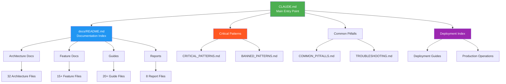
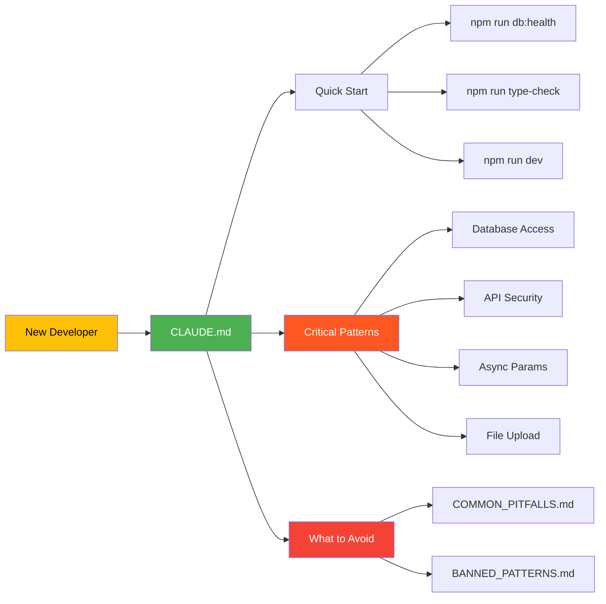
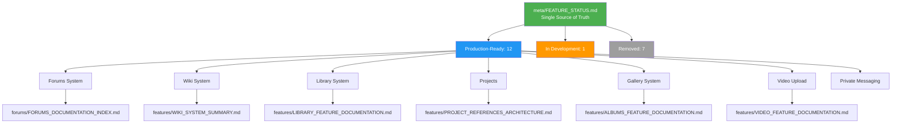
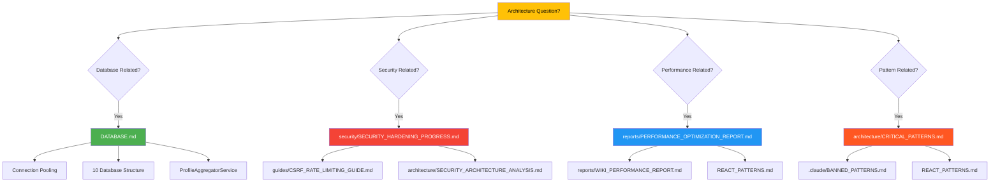
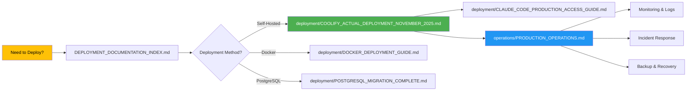
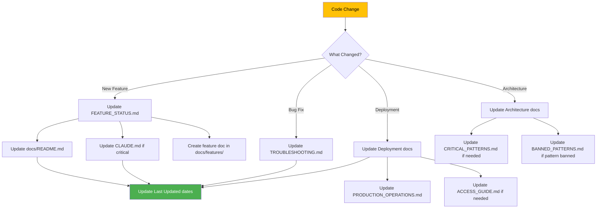

# Documentation Map

**Last Updated**: November 6, 2025
**Purpose**: Visual guide to navigate the Veritable Games documentation

---

## Overview

This map shows how all documentation files relate to each other, organized by audience and use case. Use this to quickly find the right documentation for your needs.

---

## Quick Navigation by Audience

### 🆕 New to the Codebase?
**Start Here** → [CLAUDE.md](../../CLAUDE.md) (5 minutes to understand critical patterns)
- Then → [docs/README.md](../README.md) (complete documentation index)
- Then → [docs/COMMON_PITFALLS.md](../COMMON_PITFALLS.md) (avoid 26 common mistakes)

### 🚀 Setting Up for Development?
**Start Here** → [CLAUDE.md](../../CLAUDE.md) (Quick Start section)
- Then → [docs/guides/COMMANDS_REFERENCE.md](../guides/COMMANDS_REFERENCE.md) (80+ npm scripts)
- Then → [docs/DATABASE.md](../DATABASE.md) (understand 10-database architecture)

### 🏗️ Building a Feature?
**Start Here** → [docs/architecture/CRITICAL_PATTERNS.md](../architecture/CRITICAL_PATTERNS.md)
- Then → [docs/REACT_PATTERNS.md](../REACT_PATTERNS.md) (React 19 + Next.js 15)
- Then → [docs/features/](../features/) (feature-specific documentation)

### 🔒 Security Review or Hardening?
**Start Here** → [docs/security/SECURITY_HARDENING_PROGRESS.md](../security/SECURITY_HARDENING_PROGRESS.md)
- Then → [docs/architecture/SECURITY_ARCHITECTURE_ANALYSIS.md](../architecture/SECURITY_ARCHITECTURE_ANALYSIS.md)
- Then → [docs/guides/CSRF_RATE_LIMITING_GUIDE.md](../guides/CSRF_RATE_LIMITING_GUIDE.md)

### 📦 Deploying to Production?
**Start Here** → [docs/DEPLOYMENT_DOCUMENTATION_INDEX.md](../DEPLOYMENT_DOCUMENTATION_INDEX.md)
- Then → [docs/deployment/COOLIFY_ACTUAL_DEPLOYMENT_NOVEMBER_2025.md](../deployment/COOLIFY_ACTUAL_DEPLOYMENT_NOVEMBER_2025.md)
- Then → [docs/operations/PRODUCTION_OPERATIONS.md](../operations/PRODUCTION_OPERATIONS.md)

### 🧪 Writing Tests?
**Start Here** → [docs/guides/TESTING.md](../guides/TESTING.md)
- Then → [docs/features/INVITATION_SYSTEM.md](../features/INVITATION_SYSTEM.md) (example: 61 tests)

### 🐛 Troubleshooting Issues?
**Start Here** → [docs/TROUBLESHOOTING.md](../TROUBLESHOOTING.md)
- Then → [docs/COMMON_PITFALLS.md](../COMMON_PITFALLS.md)
- Then → [docs/guides/DATABASE_MIGRATION_TROUBLESHOOTING.md](../guides/DATABASE_MIGRATION_TROUBLESHOOTING.md)

---

## Documentation Hierarchy



---

## Document Relationships by Type

### Core Documentation Flow



### Feature Documentation Structure



### Architecture Documentation Flow



### Deployment Documentation Flow



---

## Document Categories and Contents

### 1. Entry Points (Start Here)
| Document | Purpose | When to Use |
|----------|---------|-------------|
| **CLAUDE.md** | Main entry point, critical patterns, quick start | Always start here |
| **docs/README.md** | Complete documentation index | Find specific documentation |
| **docs/RECENT_CHANGES.md** | What's new, current status | Catch up on recent work |

### 2. Critical Knowledge (Must Read)
| Document | Purpose | When to Use |
|----------|---------|-------------|
| **docs/architecture/CRITICAL_PATTERNS.md** | 4 must-follow patterns (database, API, params, uploads) | Before writing any code |
| **docs/COMMON_PITFALLS.md** | 26 common mistakes to avoid | Before commits, troubleshooting |
| **docs/REACT_PATTERNS.md** | React 19 + Next.js 15 patterns | Building React components |
| **docs/DATABASE.md** | 10-database architecture | Database operations |
| **.claude/BANNED_PATTERNS.md** | Patterns NEVER to reintroduce | Architecture decisions |

### 3. Feature Documentation (15+ Files)
| Document | Feature | Status |
|----------|---------|--------|
| **docs/meta/FEATURE_STATUS.md** | All features status reference | ✅ Single source of truth |
| **docs/forums/FORUMS_DOCUMENTATION_INDEX.md** | Forums system (17 routes, 6 services) | ✅ Production |
| **docs/features/LIBRARY_FEATURE_DOCUMENTATION.md** | Library system (19+ documents) | ✅ Production |
| **docs/features/WIKI_SYSTEM_SUMMARY.md** | Wiki with revisions | ✅ Production |
| **docs/features/PROJECT_REFERENCES_ARCHITECTURE.md** | Projects & collaboration | ✅ Production |
| **docs/features/ALBUMS_FEATURE_DOCUMENTATION.md** | Gallery albums | ✅ Production |
| **docs/features/VIDEO_FEATURE_DOCUMENTATION.md** | Video upload & transcoding | ✅ Production |
| **docs/features/INVITATION_SYSTEM.md** | Invitation system (61 tests) | ✅ Production (95%) |
| **docs/features/JOURNALS_SYSTEM.md** | Zim-like journals | 🚧 In Development (85%) |

### 4. Architecture Documentation (32 Files)
| Document | Purpose | Audience |
|----------|---------|----------|
| **docs/architecture/CRITICAL_PATTERNS.md** | Must-follow patterns | All developers |
| **docs/architecture/SECURITY_ARCHITECTURE_ANALYSIS.md** | Security design | Security reviewers |
| **docs/architecture/BACKEND_ISSUES_DIAGNOSIS.md** | Backend architecture | Backend developers |
| **docs/architecture/FRONTEND_API_CONTRACT.md** | API contracts | Frontend developers |
| **docs/architecture/WIKI_ARCHITECTURE_ANALYSIS.md** | Wiki architecture | Wiki feature developers |

### 5. Guides (20+ Files)
| Document | Purpose | When to Use |
|----------|---------|-------------|
| **docs/guides/COMMANDS_REFERENCE.md** | 80+ npm scripts | Running commands |
| **docs/guides/TESTING.md** | Complete testing guide | Writing tests |
| **docs/guides/MAINTENANCE.md** | Dependency updates | Monthly maintenance |
| **docs/guides/CSRF_RATE_LIMITING_GUIDE.md** | Security implementation | Adding security |
| **docs/guides/ADMIN_INVITATION_MANAGEMENT.md** | Managing invitations | Admin tasks |
| **docs/guides/DATABASE_MIGRATION_TROUBLESHOOTING.md** | Database issues | Troubleshooting |
| **docs/guides/GITHUB_MCP_SETUP.md** | GitHub MCP for Claude Code | CI/CD monitoring |

### 6. Deployment Documentation (8 Files)
| Document | Purpose | When to Use |
|----------|---------|-------------|
| **docs/DEPLOYMENT_DOCUMENTATION_INDEX.md** | Deployment hub | Starting deployment |
| **docs/deployment/COOLIFY_ACTUAL_DEPLOYMENT_NOVEMBER_2025.md** | Actual deployment (Nov 5) | Current deployment |
| **docs/deployment/COOLIFY_LOCAL_HOSTING_GUIDE.md** | Self-hosting guide | Setting up Coolify |
| **docs/deployment/CLAUDE_CODE_PRODUCTION_ACCESS_GUIDE.md** | Production SSH & access | Working with production |
| **docs/deployment/POSTGRESQL_MIGRATION_COMPLETE.md** | PostgreSQL migration | Database migration |
| **docs/deployment/DOCKER_DEPLOYMENT_GUIDE.md** | Docker deployment | Docker setup |
| **docs/operations/PRODUCTION_OPERATIONS.md** | Operations & monitoring | Production management |

### 7. Reports & Analysis (8 Files)
| Document | Purpose | Date |
|----------|---------|------|
| **docs/reports/PERFORMANCE_OPTIMIZATION_REPORT.md** | Comprehensive perf analysis (60KB) | November 2025 |
| **docs/reports/WIKI_PERFORMANCE_REPORT.md** | Wiki-specific performance | October 2025 |
| **docs/reports/ACCESSIBILITY_IMPROVEMENTS_SUMMARY.md** | Accessibility overview | October 2025 |
| **docs/reports/ACCESSIBILITY_COMPLIANCE_REPORT.md** | Full accessibility audit | October 2025 |

### 8. Troubleshooting & Maintenance
| Document | Purpose | When to Use |
|----------|---------|-------------|
| **docs/TROUBLESHOOTING.md** | Quick fixes for common issues | When stuck |
| **docs/COMMON_PITFALLS.md** | 26 mistakes to avoid | Prevention |
| **docs/guides/DATABASE_MIGRATION_TROUBLESHOOTING.md** | Database issues | Database problems |
| **docs/guides/MAINTENANCE.md** | Dependency updates | Monthly/quarterly |

### 9. API Documentation
| Document | Purpose | Audience |
|----------|---------|----------|
| **docs/api/README.md** | Complete API reference (249 endpoints) | API consumers |
| **docs/api/authentication.md** | Auth endpoints (simplified) | Auth developers |
| **docs/api/forums.md** | Forums API | Forums developers |

### 10. CI/CD Documentation
| Document | Purpose | When to Use |
|----------|---------|-------------|
| **docs/ci-cd-documentation/CI_CD_DOCUMENTATION_INDEX.md** | CI/CD hub | Setting up workflows |
| **docs/guides/GITHUB_MCP_SETUP.md** | GitHub MCP integration | CI monitoring from Claude |

---

## Cross-Document References

### Database-Related Documentation
```
DATABASE.md (architecture)
  ├── CRITICAL_PATTERNS.md (Pattern #1: Database Access)
  ├── COMMON_PITFALLS.md (Pitfall #1: Creating Database instances)
  ├── deployment/POSTGRESQL_MIGRATION_COMPLETE.md (migration status)
  └── guides/DATABASE_MIGRATION_TROUBLESHOOTING.md (troubleshooting)
```

### Security-Related Documentation
```
security/SECURITY_HARDENING_PROGRESS.md (implementation status)
  ├── CRITICAL_PATTERNS.md (Pattern #2: API Security)
  ├── architecture/SECURITY_ARCHITECTURE_ANALYSIS.md (design analysis)
  ├── guides/CSRF_RATE_LIMITING_GUIDE.md (implementation guide)
  └── api/authentication.md (auth endpoints)
```

### Feature Development Documentation
```
meta/FEATURE_STATUS.md (status reference)
  ├── features/[FEATURE]_DOCUMENTATION.md (implementation details)
  ├── CRITICAL_PATTERNS.md (patterns to follow)
  ├── REACT_PATTERNS.md (React 19 patterns)
  └── guides/TESTING.md (testing approach)
```

### Deployment-Related Documentation
```
DEPLOYMENT_DOCUMENTATION_INDEX.md (hub)
  ├── deployment/COOLIFY_ACTUAL_DEPLOYMENT_NOVEMBER_2025.md (current)
  ├── deployment/CLAUDE_CODE_PRODUCTION_ACCESS_GUIDE.md (access)
  ├── operations/PRODUCTION_OPERATIONS.md (operations)
  └── deployment/POSTGRESQL_MIGRATION_COMPLETE.md (database)
```

---

## Documentation Update Workflow



---

## Quick Reference: "Where Do I Find...?"

| Looking For... | Go To... |
|----------------|----------|
| **How to start dev server** | CLAUDE.md → Quick Start |
| **Critical patterns to follow** | docs/architecture/CRITICAL_PATTERNS.md |
| **Common mistakes to avoid** | docs/COMMON_PITFALLS.md |
| **All available npm commands** | docs/guides/COMMANDS_REFERENCE.md |
| **Database architecture** | docs/DATABASE.md |
| **Feature status (what's working)** | docs/meta/FEATURE_STATUS.md |
| **How to deploy** | docs/DEPLOYMENT_DOCUMENTATION_INDEX.md |
| **Production server access** | docs/deployment/CLAUDE_CODE_PRODUCTION_ACCESS_GUIDE.md |
| **API reference** | docs/api/README.md |
| **React 19 patterns** | docs/REACT_PATTERNS.md |
| **Security implementation** | docs/security/SECURITY_HARDENING_PROGRESS.md |
| **How to write tests** | docs/guides/TESTING.md |
| **Performance optimization** | docs/reports/PERFORMANCE_OPTIMIZATION_REPORT.md |
| **Troubleshooting** | docs/TROUBLESHOOTING.md |
| **CI/CD setup** | docs/ci-cd-documentation/CI_CD_DOCUMENTATION_INDEX.md |
| **What NOT to do** | .claude/BANNED_PATTERNS.md |

---

## Documentation Statistics

**Total Documentation**:
- **Active Files**: 367 markdown files
- **Archived Files**: 23 files (historical reference)
- **Total Lines**: ~45,000 lines of documentation

**By Category**:
- Architecture: 32 files
- Features: 15+ files
- Guides: 20+ files
- Reports: 8 files
- Deployment: 8 files
- API: 3 files

**Documentation Quality**:
- ✅ All dates current (November 6, 2025)
- ✅ No contradictions
- ✅ All valuable docs linked from entry points
- ✅ Clear separation: active vs. archived

---

## How to Use This Map

**For Navigation**:
1. Start with "Quick Navigation by Audience" section above
2. Follow the Mermaid diagrams to understand relationships
3. Use "Quick Reference" table for specific topics

**For Understanding Structure**:
1. Review "Documentation Hierarchy" diagram
2. See "Document Categories and Contents" for detailed listings
3. Check "Cross-Document References" for related docs

**For Updates**:
1. Follow "Documentation Update Workflow" diagram
2. Update dates in modified files
3. Update this map if structure changes

---

## Maintenance

**Update This Map When**:
- New major documentation files added
- Documentation structure changes significantly
- New feature documentation created
- Deployment process changes

**Review Schedule**: Quarterly or after major releases

---

**Last Updated**: November 6, 2025
**Status**: ✅ Complete and current
**Next Review**: February 2026
