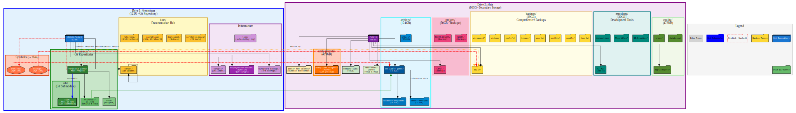

# Server Infrastructure Visualization

**Generated**: 2026-03-03 02:35:00 UTC

## Overview

This directory contains comprehensive visualizations of the Veritable Games server infrastructure, including:
- Primary drive (/home/user, 122GB) - Git repository with projects and documentation
- Secondary drive (/data, 869GB) - Large storage for archives, backups, and resources
- Cross-drive relationships (symlinks, backup flows, data dependencies)

## Files

| File | Format | Purpose | Best For |
|------|--------|---------|----------|
| `infrastructure.svg` | Vector (SVG) | Scalable graphic | Web, GitHub markdown, scaling |
| `infrastructure.png` | Raster (PNG) | High-resolution image | Presentations, printing (300 DPI) |
| `infrastructure.pdf` | Document (PDF) | Print-ready | Printing, archival |
| `infrastructure.json` | Data (JSON) | Machine-readable | Programmatic access, automation |
| `infrastructure.dot` | Text (DOT) | GraphViz source | Editing, customization |

## How to Use

### View in Browser
```bash
# SVG (best for interactive viewing)
firefox infrastructure.svg

# PNG (for presentations)
feh infrastructure.png
```

### Embed in Documentation
```markdown

```

### Print
```bash
# From PDF
lp infrastructure.pdf

# From PNG (300 DPI)
lp -h localhost infrastructure.png
```

### Customize Visualization
```bash
# Edit the DOT file to customize colors, labels, layout
vi infrastructure.dot

# Regenerate all formats
dot -Tsvg infrastructure.dot -o infrastructure.svg
dot -Tpng -Gdpi=300 infrastructure.dot -o infrastructure.png
```

## Structure Overview

### /home/user (122GB - Git Tracked)
```
/home/user/
├── docs/                           # Documentation hub (70+ guides)
│   ├── server/                     # Server operations
│   ├── veritable-games/            # Project-specific docs
│   └── ...
├── projects/
│   ├── veritable-games/            # Main project
│   │   ├── site/                   # Git submodule (Next.js app)
│   │   ├── resources/              # 3.1GB (data, scripts)
│   │   └── docs/
│   └── ...
├── scripts/                        # Server utilities
├── wireguard-backups/              # VPN configurations
├── btcpayserver-docker/            # Bitcoin infrastructure
├── backups → /data/backups         # Symlink
└── archives → /data/archives       # Symlink
```

### /data (869GB - Secondary Storage)
```
/data/
├── unity-projects/                 # 499GB (game projects)
├── archives/                       # 124GB (backups, references)
│   ├── veritable-games/            # 3.8GB
│   ├── database-snapshots/         # 4.2GB
│   └── server-backups/             # 2.1GB
├── company-site/                   # 66GB
├── references/                     # 58GB (tools, docs)
├── projects/                       # 50GB (ENACT, NOXII backups)
├── backups/                        # 39GB (comprehensive backups)
│   ├── daily/
│   ├── hourly/
│   ├── weekly/
│   ├── monthly/
│   ├── btcpay/
│   ├── coolify/
│   └── wireguard/
├── repository/                     # 30GB (dev tools)
│   ├── AI-ML/
│   ├── 3D-Graphics/
│   └── ...
├── coolify/                        # Services configuration
└── docker-hdd-volumes/             # Bitcoin blockchain
```

## Key Relationships

### Symlinks
- `/home/user/backups/` → `/data/backups/`
- `/home/user/archives/` → `/data/archives/`

### Git Repositories
- `/home/user/` - Server configuration repository
- `/home/user/projects/veritable-games/site/` - Main project (Git submodule)
- `/home/user/btcpayserver-docker/` - Bitcoin infrastructure (Git submodule)

### Backup Flows
- Server config → `/data/backups/daily/`
- PostgreSQL database → `/data/backups/daily/`
- Coolify services → `/data/backups/coolify/`
- WireGuard configs → `/data/backups/wireguard/`

### Color Scheme in Visualization
| Color | Type | Examples |
|-------|------|----------|
| 🔵 Blue | Git Repositories | /home/user, site/ |
| 🟢 Green | Project Data | veritable-games, resources |
| 🟡 Yellow | Backups | daily/, hourly/, weekly/ |
| 🟠 Orange | Infrastructure | btcpayserver, bitcoin |
| 🟣 Purple | Services | coolify, docker |
| 🔴 Red Dashed | Symlinks | backups, archives |

## Generation Workflow

The visualization is generated automatically using a three-phase process:

### Phase 1: Data Collection
```bash
bash /home/user/scripts/infrastructure/map-infrastructure.sh
```
Collects directory trees, sizes, symlinks, git info, docker containers

### Phase 2: Relationship Analysis
```bash
python3 /home/user/scripts/infrastructure/analyze-relationships.py
```
Maps symlinks, submodules, backups, project resources, mount points

### Phase 3: GraphViz Generation
```bash
python3 /home/user/scripts/infrastructure/generate-graphviz.py
```
Generates comprehensive DOT file with hierarchical clustering

### Phase 4: Rendering
```bash
bash /home/user/scripts/infrastructure/render-all-formats.sh
```
Renders DOT to SVG, PNG, PDF, JSON, and saves this README

## To Regenerate

```bash
# Run all phases in sequence
bash /home/user/scripts/infrastructure/map-infrastructure.sh
python3 /home/user/scripts/infrastructure/analyze-relationships.py
python3 /home/user/scripts/infrastructure/generate-graphviz.py
bash /home/user/scripts/infrastructure/render-all-formats.sh
```

## Technical Details

**Generated With**:
- GraphViz (dot)
- Python 3
- Bash scripts

**Visualization Features**:
- Hierarchical clustering (drives, categories)
- Color-coded nodes by purpose
- Size-based node sizing
- Edge labels for relationships
- Legend showing symbols

**Data Sources**:
- `du -sh` for directory sizes
- `find` for directory structure
- `tree` for JSON trees
- `docker` for container info
- `.gitmodules` for submodule info

## License

Infrastructure visualization for Veritable Games server documentation.
Auto-generated - do not edit manually. Regenerate using provided scripts.
