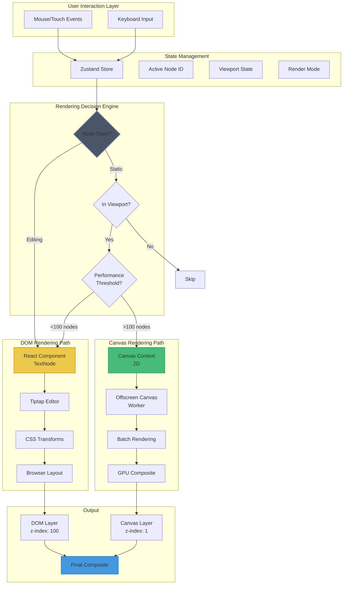
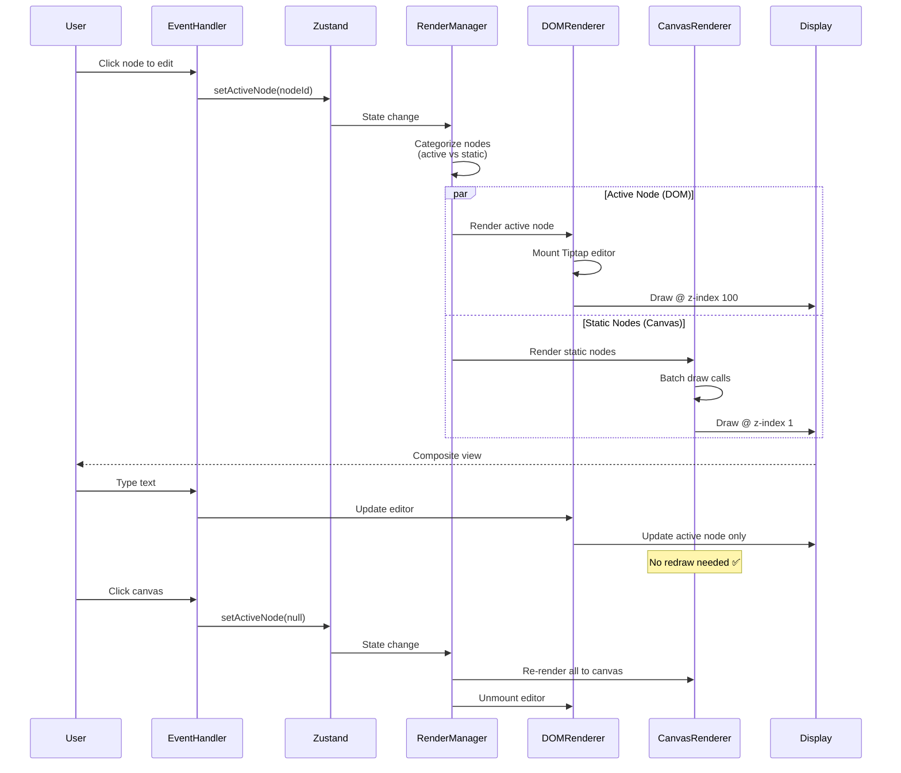
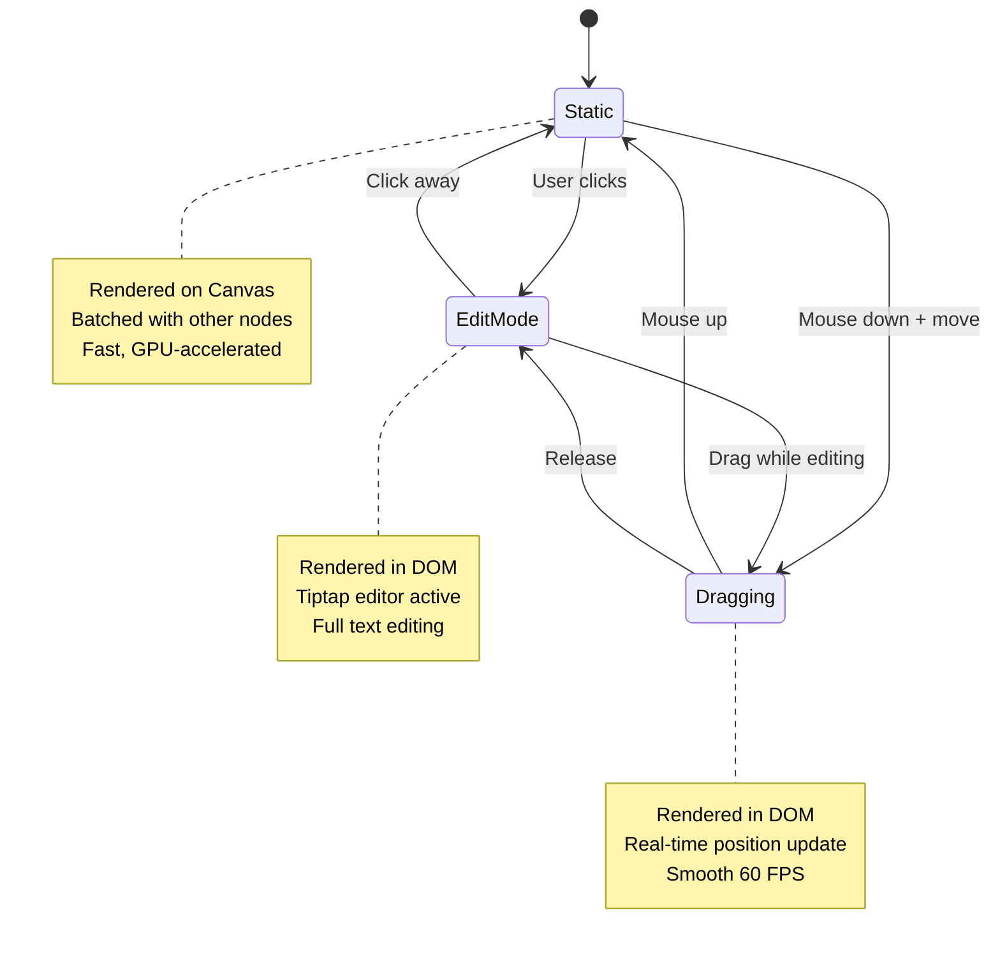
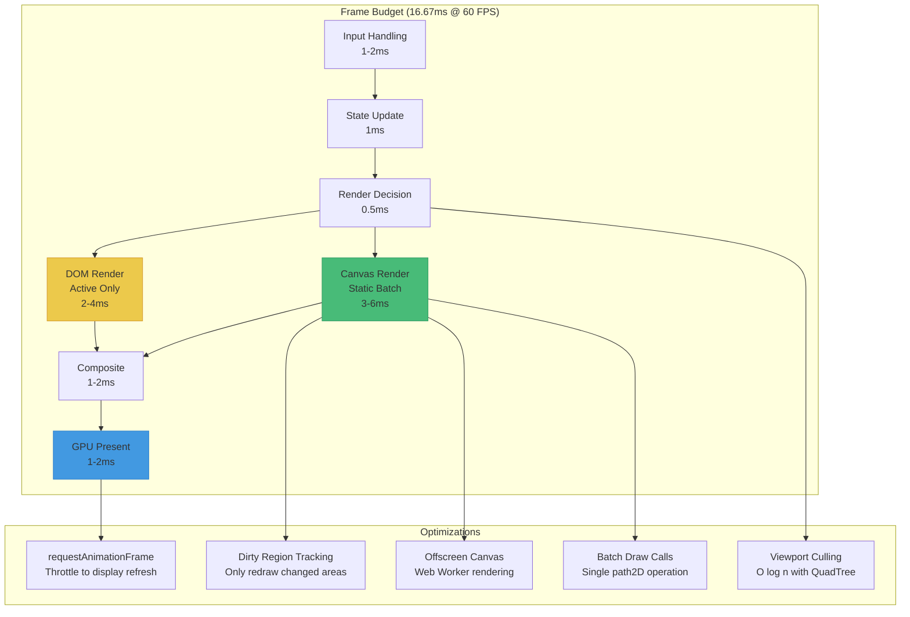
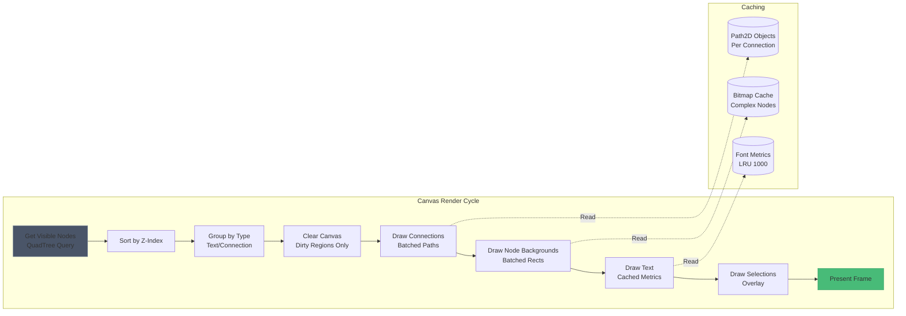
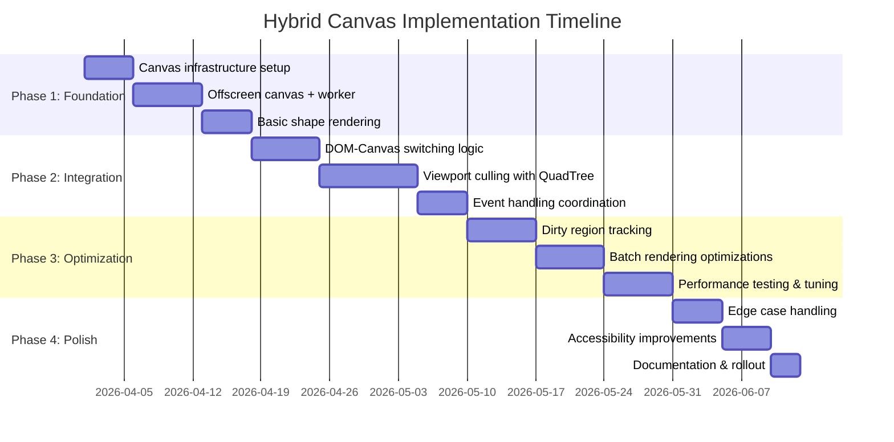

# Hybrid Canvas Architecture (Proposed)

This diagram details the proposed hybrid rendering architecture that combines DOM for active editing with Canvas for static rendering.

## High-Level Architecture



## Detailed Rendering Flow



## Node State Machine



## Performance Optimization Strategy



## Canvas Rendering Pipeline Detail



## Implementation Phases



## Expected Performance Improvements

| Metric | Current (DOM) | Hybrid | Improvement |
|--------|---------------|--------|-------------|
| **FPS @ 100 nodes** | 55-58 | 60 | +3-9% |
| **FPS @ 500 nodes** | 35-40 | 50-55 | +43-57% |
| **FPS @ 1000 nodes** | 25-30 | 45-50 | +67-100% |
| **FPS @ 2000 nodes** | 15-20 | 35-40 | +100-167% |
| **Memory @ 1000 nodes** | 180 MB | 120 MB | -33% |
| **Initial render** | 400ms | 150ms | -63% |

## Code Structure

```
/frontend/src/components/workspace/
├── WorkspaceCanvas.tsx          (Orchestrator - 300 lines)
│   ├── State management
│   ├── Event routing
│   └── Layer coordination
│
├── renderers/
│   ├── DOMRenderer.tsx          (Active nodes - 200 lines)
│   │   └── Tiptap integration
│   │
│   └── CanvasRenderer.tsx       (Static nodes - 400 lines)
│       ├── OffscreenCanvas worker
│       ├── Batch rendering
│       └── Dirty tracking
│
├── layers/
│   ├── DOMLayer.tsx             (z-index: 100)
│   └── CanvasLayer.tsx          (z-index: 1)
│
└── utils/
    ├── viewport-culling.ts      (QuadTree spatial index)
    ├── render-decision.ts       (Route to DOM vs Canvas)
    └── canvas-batching.ts       (Optimize draw calls)
```

## Migration Strategy

1. **Feature flag**: `ENABLE_HYBRID_CANVAS=true/false`
2. **A/B testing**: 50% users on hybrid, 50% on DOM
3. **Performance monitoring**: Track FPS, memory, crashes
4. **Gradual rollout**:
   - Week 1: Internal testing
   - Week 2: Beta users (10%)
   - Week 3: Expand to 50%
   - Week 4: Full rollout

## References

- Current Implementation: `/frontend/src/components/workspace/WorkspaceCanvas.tsx`
- Viewport Culling: `/frontend/src/lib/workspace/viewport-culling.ts`
- Performance Analysis: `/docs/architecture/workspace-technical-comparison-feb-2026.md`
- Effort Estimate: 40-50 hours (Q2 2026)
