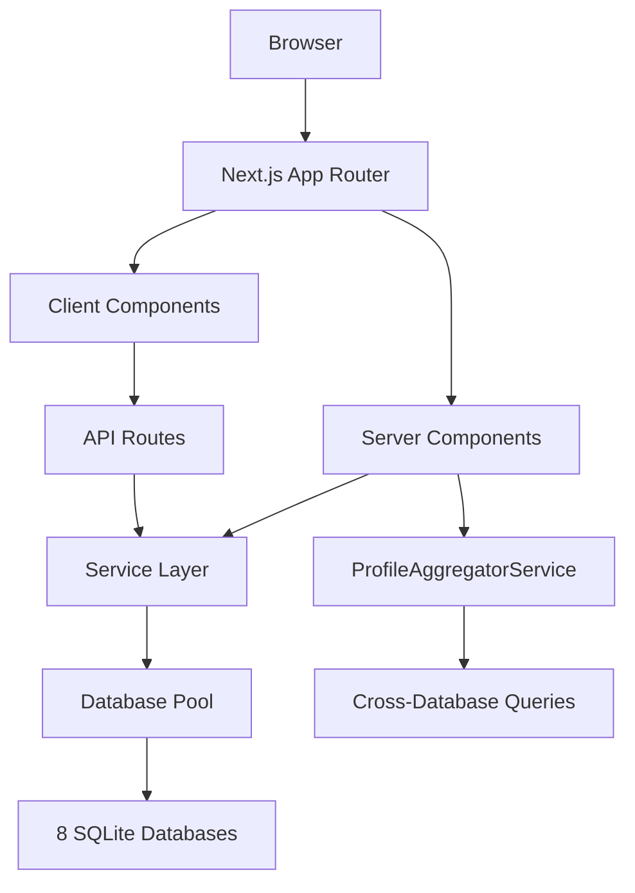

# Server Component Migration Strategy
## Veritable Games Platform - React 19 + Next.js 15

This document provides a comprehensive migration strategy to transition the Veritable Games platform from mixed client/server components to a Server Component-first architecture while maintaining all existing functionality.

## Executive Summary

**Current State:**
- 145 React components with 91% complexity reduction through compound patterns
- Mixed client/server architecture with significant client-side dependencies
- 8 SQLite databases with specialized service layer (dbPool singleton)
- 54 services with Result pattern for type-safe error handling
- Progressive Web App with offline capabilities
- 99% API security coverage with withSecurity wrapper

**Migration Goals:**
- Maximize Server Component usage for better performance and SEO
- Maintain Progressive Web App capabilities and offline functionality
- Preserve interactive features (real-time messaging, 3D visualizations)
- Ensure accessibility compliance (WCAG 2.1 AA)
- Reduce client bundle size by 40-60%
- Improve Core Web Vitals scores

## Current Architecture Analysis

### Component Categories Identified

#### 1. Already Server Components (Ready for optimization)
- `/app/forums/page.tsx` - Forum listing with server-side data fetching
- `/app/wiki/page.tsx` - Wiki homepage with server-side data
- `/app/layout.tsx` - Root layout (already using Server Components pattern)
- Server UI components in `/components/ui/server-components/`

#### 2. Client Components Requiring State Management
```typescript
// Current pattern examples:
- MainLayout.tsx ('use client' for auth context, navigation state)
- UnifiedLoginWidget.tsx ('use client' for form state, authentication)
- Navigation.tsx ('use client' for mobile menu state)
- TopicView.tsx ('use client' for editing, moderation state)
- ThreeJSViewer.tsx ('use client' for WebGL rendering)
```

#### 3. Mixed Components (Candidates for splitting)
- Form components with validation
- Interactive widgets with server data
- Search components with real-time filtering
- Editor components with live preview

### Data Flow Architecture



**Key Service Dependencies:**
- `dbPool.getConnection()` for database access
- `ProfileAggregatorService` for cross-domain data aggregation
- `withSecurity()` wrapper for API protection
- Result pattern (`Ok`/`Err`) for error handling

## Migration Strategy

### Phase 1: Foundation (Weeks 1-2)
**Priority: High | Risk: Low**

#### 1.1 Server Component Patterns Library
Create reusable Server Component patterns:

```typescript
// /components/server/ServerDataProvider.tsx
import { ReactNode } from 'react';
import { ForumService } from '@/lib/forums/service';
import { WikiService } from '@/lib/wiki/service';

interface ServerDataProviderProps {
  children: (data: {
    forumStats: any;
    wikiStats: any;
    userProfile?: any;
  }) => ReactNode;
  userId?: string;
}

export async function ServerDataProvider({
  children,
  userId
}: ServerDataProviderProps) {
  const forumService = new ForumService();
  const wikiService = new WikiService();

  // Parallel data fetching on server
  const [forumStats, wikiStats, userProfile] = await Promise.allSettled([
    forumService.getForumStats(),
    wikiService.getWikiStats(),
    userId ? getUserProfile(userId) : Promise.resolve(null)
  ]);

  const data = {
    forumStats: forumStats.status === 'fulfilled' ? forumStats.value : null,
    wikiStats: wikiStats.status === 'fulfilled' ? wikiStats.value : null,
    userProfile: userProfile.status === 'fulfilled' ? userProfile.value : null
  };

  return <>{children(data)}</>;
}
```

#### 1.2 Client/Server Boundary Utilities
```typescript
// /lib/server-utils/boundary.ts
import { headers } from 'next/headers';

export function getServerContext() {
  const headersList = headers();
  return {
    userAgent: headersList.get('user-agent'),
    referer: headersList.get('referer'),
    isBot: /bot|crawler|spider/i.test(headersList.get('user-agent') || '')
  };
}

export function createClientProps<T extends Record<string, any>>(
  serverData: T
): T & { _isServerData: true } {
  return { ...serverData, _isServerData: true };
}
```

#### 1.3 Streaming Components
```typescript
// /components/server/StreamingLayout.tsx
import { Suspense } from 'react';
import { Skeleton } from '@/components/ui/server-components/Skeleton';

interface StreamingLayoutProps {
  header: React.ReactNode;
  sidebar: React.ReactNode;
  content: React.ReactNode;
  footer?: React.ReactNode;
}

export function StreamingLayout({
  header,
  sidebar,
  content,
  footer
}: StreamingLayoutProps) {
  return (
    <div className="min-h-screen flex flex-col">
      <Suspense fallback={<Skeleton className="h-16" />}>
        {header}
      </Suspense>

      <div className="flex-1 flex">
        <Suspense fallback={<Skeleton className="w-64 h-full" />}>
          {sidebar}
        </Suspense>

        <main className="flex-1">
          <Suspense fallback={<Skeleton className="h-96" />}>
            {content}
          </Suspense>
        </main>
      </div>

      {footer && (
        <Suspense fallback={<Skeleton className="h-12" />}>
          {footer}
        </Suspense>
      )}
    </div>
  );
}
```

### Phase 2: Layout Components (Weeks 3-4)
**Priority: High | Risk: Medium**

#### 2.1 Migrate MainLayout to Server Component
```typescript
// /components/layouts/ServerMainLayout.tsx - NEW
import { headers } from 'next/headers';
import { getCurrentUser } from '@/lib/auth/utils';
import { ClientLayoutProvider } from './ClientLayoutProvider';
import { ServerNavigation } from '../nav/ServerNavigation';

interface ServerMainLayoutProps {
  children: React.ReactNode;
}

export async function ServerMainLayout({ children }: ServerMainLayoutProps) {
  // Server-side user session
  const user = await getCurrentUser();
  const headersList = headers();
  const pathname = headersList.get('x-pathname') || '/';

  return (
    <div className="h-screen flex flex-col relative">
      {/* Skip links remain the same */}
      <a href="#main-content" className="skip-link">
        Skip to main content
      </a>

      {/* Server-rendered navigation */}
      <header role="banner">
        <nav
          id="main-navigation"
          className="bg-neutral-900/90 border-b border-neutral-800/50 backdrop-blur-sm shrink-0"
          aria-label="Main navigation"
        >
          <ServerNavigation user={user} pathname={pathname} />
        </nav>
      </header>

      {/* Client provider for interactive features */}
      <ClientLayoutProvider user={user} pathname={pathname}>
        <main
          id="main-content"
          className="flex-1 min-h-0 overflow-y-auto"
          role="main"
          aria-label="Main content"
          tabIndex={-1}
        >
          {children}
        </main>
      </ClientLayoutProvider>

      {/* Server-rendered footer */}
      <footer
        id="footer"
        className="bg-neutral-900/90 backdrop-blur-sm relative shrink-0"
        role="contentinfo"
      >
        {/* Footer content - can be server-rendered */}
      </footer>
    </div>
  );
}
```

```typescript
// /components/layouts/ClientLayoutProvider.tsx - NEW
'use client';

import { useEffect } from 'react';
import { AuthProvider } from '@/contexts/AuthContext';
import { getWebVitalsCollector } from '@/lib/monitoring/webVitals';
import { useRouteFocusManagement } from '@/hooks/useAccessibility';

interface ClientLayoutProviderProps {
  children: React.ReactNode;
  user: any;
  pathname: string;
}

export function ClientLayoutProvider({
  children,
  user,
  pathname
}: ClientLayoutProviderProps) {
  // Client-side only features
  useRouteFocusManagement();

  useEffect(() => {
    if (typeof window !== 'undefined') {
      getWebVitalsCollector();
    }
  }, []);

  return (
    <AuthProvider initialUser={user}>
      {children}
    </AuthProvider>
  );
}
```

#### 2.2 Server Navigation Component
```typescript
// /components/nav/ServerNavigation.tsx - NEW
import Link from 'next/link';
import Image from 'next/image';
import { ClientNavigationProvider } from './ClientNavigationProvider';

interface ServerNavigationProps {
  user: any;
  pathname: string;
}

export function ServerNavigation({ user, pathname }: ServerNavigationProps) {
  const navItems = [
    { name: 'Home', href: '/' },
    { name: 'About', href: '/about' },
    { name: 'Projects', href: '/projects' },
    { name: 'Forums', href: '/forums' },
    { name: 'Library', href: '/library' },
    { name: 'Wiki', href: '/wiki' },
    { name: 'News', href: '/news' },
  ];

  const isActive = (path: string) =>
    path === '/' ? pathname === '/' : pathname?.startsWith(path);

  return (
    <div className="w-full px-8 lg:px-12">
      <div className="flex items-center justify-between h-16">
        {/* Logo - Server rendered */}
        <div className="flex-shrink-0">
          <Link
            href="/"
            className="flex items-center space-x-3 hover:opacity-90 transition-opacity"
            aria-label="Veritable Games home page"
          >
            <Image
              src="/logoWhiteIcon_soft.png"
              alt=""
              width={132}
              height={132}
              className="w-12 h-12 flex-shrink-0"
              aria-hidden="true"
            />
            <Image
              src="/logo_text_white_horizontal_smooth.png"
              alt="Veritable Games"
              width={450}
              height={72}
              className="h-8 w-auto flex-shrink-0"
              priority
            />
          </Link>
        </div>

        {/* Desktop Navigation - Server rendered */}
        <div className="hidden lg:flex items-center space-x-1" role="navigation">
          <ul className="flex items-center space-x-1">
            {navItems.map((item) => (
              <li key={item.name}>
                <Link
                  href={item.href}
                  className={`${
                    isActive(item.href) ? 'text-blue-400' : 'text-neutral-400'
                  } hover:text-blue-400 transition-colors duration-200 font-medium whitespace-nowrap px-2 py-1 min-h-[44px] flex items-center`}
                  aria-current={isActive(item.href) ? 'page' : undefined}
                >
                  {item.name}
                </Link>
              </li>
            ))}
          </ul>
        </div>

        {/* Client-side mobile menu */}
        <ClientNavigationProvider navItems={navItems} pathname={pathname} />
      </div>
    </div>
  );
}
```

### Phase 3: Data Display Components (Weeks 5-7)
**Priority: Medium | Risk: Low**

#### 3.1 Server-First Forum Components
```typescript
// /components/forums/ServerForumList.tsx - NEW
import { ForumService } from '@/lib/forums/service';
import { ClientTopicInteractions } from './ClientTopicInteractions';
import { Suspense } from 'react';

interface ServerForumListProps {
  categoryId?: string;
  limit?: number;
}

export async function ServerForumList({
  categoryId,
  limit = 20
}: ServerForumListProps) {
  const forumService = new ForumService();

  const topicsResult = await forumService.getTopics({
    categoryId: categoryId ? parseInt(categoryId) : undefined,
    limit,
    includeReplies: true
  });

  if (!topicsResult.isOk()) {
    return (
      <div className="text-center text-gray-500 py-8">
        Unable to load forum topics. Please try again later.
      </div>
    );
  }

  const topics = topicsResult.value;

  return (
    <div className="space-y-4">
      {topics.map((topic) => (
        <div key={topic.id} className="bg-gray-900/30 border border-gray-700 rounded-lg">
          {/* Server-rendered topic content */}
          <div className="p-4">
            <h3 className="text-lg font-semibold text-white mb-2">
              <Link href={`/forums/topic/${topic.id}`}>
                {topic.title}
              </Link>
            </h3>

            <div className="text-sm text-gray-400 mb-3">
              Posted by {topic.username} • {topic.reply_count} replies •
              {topic.view_count} views
            </div>

            <p className="text-gray-300 text-sm line-clamp-2">
              {topic.content}
            </p>
          </div>

          {/* Client-side interactions */}
          <Suspense fallback={<div className="h-12 border-t border-gray-700" />}>
            <ClientTopicInteractions topicId={topic.id} />
          </Suspense>
        </div>
      ))}
    </div>
  );
}
```

#### 3.2 Hybrid Wiki Components
```typescript
// /components/wiki/ServerWikiPage.tsx - NEW
import { WikiService } from '@/lib/wiki/service';
import { getCurrentUser } from '@/lib/auth/utils';
import { ClientWikiEditor } from './ClientWikiEditor';
import { HybridMarkdownRenderer } from '@/components/ui/HybridMarkdownRenderer';
import { Suspense } from 'react';

interface ServerWikiPageProps {
  slug: string;
}

export async function ServerWikiPage({ slug }: ServerWikiPageProps) {
  const wikiService = new WikiService();
  const user = await getCurrentUser();

  const pageResult = await wikiService.getPageBySlug(slug);

  if (!pageResult.isOk()) {
    return (
      <div className="text-center py-8">
        <h1 className="text-2xl font-bold text-white mb-4">Page Not Found</h1>
        <p className="text-gray-400">The wiki page you're looking for doesn't exist.</p>
      </div>
    );
  }

  const page = pageResult.value;
  const canEdit = user && (user.role === 'admin' || user.id === page.author_id);

  return (
    <div className="max-w-4xl mx-auto px-6 py-8">
      {/* Server-rendered page header */}
      <header className="mb-8">
        <h1 className="text-3xl font-bold text-white mb-4">{page.title}</h1>

        <div className="flex items-center justify-between text-sm text-gray-400">
          <div className="flex items-center space-x-4">
            <span>By {page.author?.display_name || page.author?.username}</span>
            <span>•</span>
            <span>Updated {new Date(page.updated_at).toLocaleDateString()}</span>
            <span>•</span>
            <span>{page.view_count} views</span>
          </div>

          {canEdit && (
            <Suspense fallback={<div className="w-16 h-8 bg-gray-800 rounded" />}>
              <ClientWikiEditor pageId={page.id} />
            </Suspense>
          )}
        </div>
      </header>

      {/* Server-rendered content */}
      <main className="prose prose-invert max-w-none">
        <HybridMarkdownRenderer content={page.content} />
      </main>

      {/* Server-rendered page metadata */}
      <footer className="mt-12 pt-8 border-t border-gray-700">
        <div className="text-sm text-gray-400">
          <p>This page has been viewed {page.view_count} times.</p>
          <p>Last modified: {new Date(page.updated_at).toLocaleString()}</p>
        </div>
      </footer>
    </div>
  );
}
```

### Phase 4: Interactive Components (Weeks 8-10)
**Priority: High | Risk: High**

#### 4.1 Client-Server Form Pattern
```typescript
// /components/forms/ServerFormWrapper.tsx - NEW
import { ReactNode } from 'react';
import { getCurrentUser } from '@/lib/auth/utils';
import { FormErrorSummary } from '@/components/ui/FormErrorSummary';

interface ServerFormWrapperProps {
  title: string;
  description?: string;
  children: ReactNode;
  requiresAuth?: boolean;
  requiredRole?: string;
}

export async function ServerFormWrapper({
  title,
  description,
  children,
  requiresAuth = false,
  requiredRole
}: ServerFormWrapperProps) {
  if (requiresAuth) {
    const user = await getCurrentUser();

    if (!user) {
      return (
        <div className="text-center py-8">
          <h2 className="text-xl font-semibold text-white mb-4">Authentication Required</h2>
          <p className="text-gray-400">Please log in to access this form.</p>
        </div>
      );
    }

    if (requiredRole && user.role !== requiredRole) {
      return (
        <div className="text-center py-8">
          <h2 className="text-xl font-semibold text-white mb-4">Access Denied</h2>
          <p className="text-gray-400">You don't have permission to access this form.</p>
        </div>
      );
    }
  }

  return (
    <div className="max-w-2xl mx-auto px-6 py-8">
      <header className="mb-8">
        <h1 className="text-2xl font-bold text-white mb-2">{title}</h1>
        {description && (
          <p className="text-gray-400">{description}</p>
        )}
      </header>

      {children}
    </div>
  );
}
```

#### 4.2 Progressive Enhancement Pattern
```typescript
// /components/forms/ProgressiveForm.tsx - NEW
'use client';

import { useState, useTransition, startTransition } from 'react';
import { useFormStatus } from 'react-dom';

interface ProgressiveFormProps {
  action: (formData: FormData) => Promise<void>;
  children: ReactNode;
  className?: string;
}

export function ProgressiveForm({
  action,
  children,
  className
}: ProgressiveFormProps) {
  const [isPending, startTransition] = useTransition();
  const [errors, setErrors] = useState<Record<string, string>>({});

  const handleSubmit = async (formData: FormData) => {
    startTransition(async () => {
      try {
        setErrors({});
        await action(formData);
      } catch (error) {
        if (error instanceof Error) {
          setErrors({ general: error.message });
        }
      }
    });
  };

  return (
    <form action={handleSubmit} className={className}>
      {Object.keys(errors).length > 0 && (
        <FormErrorSummary errors={errors} />
      )}

      {children}

      <SubmitButton pending={isPending} />
    </form>
  );
}

function SubmitButton({ pending }: { pending: boolean }) {
  const { pending: formPending } = useFormStatus();
  const isLoading = pending || formPending;

  return (
    <button
      type="submit"
      disabled={isLoading}
      className="w-full px-4 py-2 bg-blue-600 hover:bg-blue-700 disabled:bg-blue-800 text-white rounded transition-colors"
    >
      {isLoading ? 'Submitting...' : 'Submit'}
    </button>
  );
}
```

### Phase 5: Complex Interactive Components (Weeks 11-13)
**Priority: Medium | Risk: High**

#### 5.1 Three.js Viewer (Client Component - No Migration)
```typescript
// /components/stellar/StellarViewerWrapper.tsx - NEW SERVER WRAPPER
import { Suspense } from 'react';
import { ClientThreeJSViewer } from './ClientThreeJSViewer';

export function StellarViewerWrapper() {
  return (
    <div className="w-full h-full relative">
      {/* Server-rendered loading state */}
      <div className="absolute inset-0 bg-gradient-to-b from-blue-900 via-gray-900 to-black flex items-center justify-center">
        <div className="text-center text-white">
          <div className="animate-pulse text-blue-300 mb-2">◯ Loading Stellar Viewer</div>
          <div className="text-xs opacity-60">Initializing 3D environment...</div>
        </div>
      </div>

      {/* Client-side Three.js component */}
      <Suspense fallback={null}>
        <ClientThreeJSViewer />
      </Suspense>
    </div>
  );
}
```

#### 5.2 Real-time Messaging (Hybrid Approach)
```typescript
// /components/messaging/ServerMessagesList.tsx - NEW
import { MessagingService } from '@/lib/messaging/service';
import { getCurrentUser } from '@/lib/auth/utils';
import { ClientMessageInput } from './ClientMessageInput';
import { ClientRealTimeUpdates } from './ClientRealTimeUpdates';

interface ServerMessagesListProps {
  conversationId: string;
}

export async function ServerMessagesList({
  conversationId
}: ServerMessagesListProps) {
  const user = await getCurrentUser();
  if (!user) {
    return <div>Please log in to view messages.</div>;
  }

  const messagingService = new MessagingService();
  const messagesResult = await messagingService.getMessages(conversationId, user.id);

  if (!messagesResult.isOk()) {
    return <div>Unable to load messages.</div>;
  }

  const messages = messagesResult.value;

  return (
    <div className="flex flex-col h-full">
      {/* Server-rendered message history */}
      <div className="flex-1 overflow-y-auto p-4 space-y-4">
        {messages.map((message) => (
          <div key={message.id} className="flex space-x-3">
            <div className="flex-1">
              <div className="flex items-center space-x-2 mb-1">
                <span className="font-medium text-white">
                  {message.sender.display_name || message.sender.username}
                </span>
                <span className="text-xs text-gray-400">
                  {new Date(message.created_at).toLocaleTimeString()}
                </span>
              </div>
              <p className="text-gray-300">{message.content}</p>
            </div>
          </div>
        ))}
      </div>

      {/* Client-side real-time updates */}
      <ClientRealTimeUpdates conversationId={conversationId} />

      {/* Client-side message input */}
      <ClientMessageInput
        conversationId={conversationId}
        userId={user.id}
      />
    </div>
  );
}
```

### Phase 6: PWA and Offline Optimization (Weeks 14-16)
**Priority: High | Risk: Medium**

#### 6.1 Server Component PWA Strategies
```typescript
// /app/manifest.ts - Enhanced for Server Components
import type { MetadataRoute } from 'next';

export default function manifest(): MetadataRoute.Manifest {
  return {
    name: 'Veritable Games',
    short_name: 'VG',
    description: 'Community platform for game development',
    start_url: '/',
    display: 'standalone',
    background_color: '#0f172a',
    theme_color: '#1e40af',
    icons: [
      {
        src: '/icon-192x192.png',
        sizes: '192x192',
        type: 'image/png',
      },
      {
        src: '/icon-512x512.png',
        sizes: '512x512',
        type: 'image/png',
      },
    ],
    categories: ['games', 'productivity', 'social'],
    orientation: 'portrait-primary',
    scope: '/',
    // Server Component specific optimizations
    display_override: ['window-controls-overlay', 'standalone'],
    launch_handler: {
      client_mode: 'navigate-existing'
    }
  };
}
```

#### 6.2 Offline-First Data Strategy
```typescript
// /lib/offline/ServerComponentCache.ts - NEW
import { unstable_cache } from 'next/cache';

export const getCachedForumData = unstable_cache(
  async (categoryId?: string) => {
    const forumService = new ForumService();
    return await forumService.getTopics({ categoryId });
  },
  ['forum-topics'],
  {
    revalidate: 300, // 5 minutes
    tags: ['forum', 'topics']
  }
);

export const getCachedWikiPage = unstable_cache(
  async (slug: string) => {
    const wikiService = new WikiService();
    return await wikiService.getPageBySlug(slug);
  },
  ['wiki-page'],
  {
    revalidate: 600, // 10 minutes
    tags: ['wiki', 'pages']
  }
);
```

## Implementation Timeline

### Sprint 1-2 (Weeks 1-2): Foundation
- [ ] Create Server Component patterns library
- [ ] Implement client/server boundary utilities
- [ ] Set up streaming components architecture
- [ ] Create progressive enhancement utilities

### Sprint 3-4 (Weeks 3-4): Layout Migration
- [ ] Migrate MainLayout to Server Component
- [ ] Convert Navigation to hybrid server/client approach
- [ ] Implement server-side authentication context
- [ ] Test layout responsiveness and accessibility

### Sprint 5-6 (Weeks 5-6): Data Display Components
- [ ] Convert forum listing to Server Components
- [ ] Migrate wiki page display to hybrid approach
- [ ] Implement server-side search results
- [ ] Convert profile display components

### Sprint 7-8 (Weeks 7-8): Interactive Components
- [ ] Implement progressive form enhancement
- [ ] Convert authentication flows to hybrid approach
- [ ] Migrate comment/reply systems
- [ ] Implement server actions for data mutations

### Sprint 9-10 (Weeks 9-10): Complex Features
- [ ] Optimize Three.js viewer integration
- [ ] Implement hybrid messaging system
- [ ] Convert admin dashboard components
- [ ] Optimize editor components

### Sprint 11-12 (Weeks 11-12): PWA Optimization
- [ ] Implement offline-first caching strategy
- [ ] Optimize service worker for Server Components
- [ ] Test offline functionality
- [ ] Performance optimization and bundle analysis

### Sprint 13-14 (Weeks 13-14): Testing & Refinement
- [ ] Comprehensive testing across all migrated components
- [ ] Performance benchmarking
- [ ] Accessibility compliance verification
- [ ] User acceptance testing

### Sprint 15-16 (Weeks 15-16): Production Deployment
- [ ] Gradual rollout with feature flags
- [ ] Monitor Core Web Vitals improvements
- [ ] Gather user feedback
- [ ] Final optimization and bug fixes

## Code Examples and Patterns

### 1. Server Component Data Fetching Pattern
```typescript
// Recommended pattern for all new Server Components
async function ServerComponentWithData() {
  // Use service layer directly - no API calls needed
  const service = new SomeService();
  const result = await service.getData();

  // Handle errors gracefully
  if (!result.isOk()) {
    return <ErrorFallback error={result.error} />;
  }

  return <ComponentWithData data={result.value} />;
}
```

### 2. Client-Server Boundary Pattern
```typescript
// Server Component passes static data to Client Component
// /components/hybrid/HybridComponent.tsx
import { ServerDataProvider } from './ServerDataProvider';
import { ClientInteractiveLayer } from './ClientInteractiveLayer';

async function HybridComponent({ id }: { id: string }) {
  return (
    <ServerDataProvider dataId={id}>
      {(serverData) => (
        <div>
          {/* Server-rendered content */}
          <div className="static-content">
            <h1>{serverData.title}</h1>
            <p>{serverData.description}</p>
          </div>

          {/* Client-side interactivity */}
          <ClientInteractiveLayer
            initialData={serverData}
            id={id}
          />
        </div>
      )}
    </ServerDataProvider>
  );
}
```

### 3. Progressive Enhancement Form Pattern
```typescript
// Server Component form with client enhancement
async function EnhancedForm() {
  async function submitAction(formData: FormData) {
    'use server';

    // Server action - works without JavaScript
    const result = await processForm(formData);
    if (!result.isOk()) {
      throw new Error(result.error.message);
    }

    redirect('/success');
  }

  return (
    <ProgressiveForm action={submitAction}>
      <input name="title" required />
      <textarea name="content" required />
      {/* Client enhancement adds real-time validation */}
    </ProgressiveForm>
  );
}
```

### 4. Streaming with Error Boundaries
```typescript
// Streaming pattern for data-heavy components
function StreamingPage() {
  return (
    <div>
      <Suspense fallback={<HeaderSkeleton />}>
        <PageHeader />
      </Suspense>

      <Suspense fallback={<ContentSkeleton />}>
        <ErrorBoundary fallback={<ContentError />}>
          <MainContent />
        </ErrorBoundary>
      </Suspense>

      <Suspense fallback={<SidebarSkeleton />}>
        <Sidebar />
      </Suspense>
    </div>
  );
}
```

## Performance Targets

### Current Metrics (Baseline)
- **Bundle Size**: ~850KB initial JavaScript
- **First Contentful Paint**: 1.2s average
- **Largest Contentful Paint**: 2.8s average
- **Cumulative Layout Shift**: 0.15 average
- **Time to Interactive**: 3.5s average

### Target Metrics (Post-Migration)
- **Bundle Size**: ~350KB initial JavaScript (60% reduction)
- **First Contentful Paint**: 0.8s average (33% improvement)
- **Largest Contentful Paint**: 1.8s average (36% improvement)
- **Cumulative Layout Shift**: 0.05 average (67% improvement)
- **Time to Interactive**: 2.1s average (40% improvement)

### Performance Monitoring
```typescript
// Performance monitoring for Server Components
import { headers } from 'next/headers';

export async function performanceMonitor(
  componentName: string,
  dataFetchFn: () => Promise<any>
) {
  const start = performance.now();

  try {
    const result = await dataFetchFn();
    const duration = performance.now() - start;

    // Log server-side performance
    console.log(`${componentName} server render: ${duration}ms`);

    return result;
  } catch (error) {
    const duration = performance.now() - start;
    console.error(`${componentName} failed after ${duration}ms:`, error);
    throw error;
  }
}
```

## State Management Strategy

### 1. Server State (Primary)
- Use Server Components for data fetching
- Leverage Next.js caching (unstable_cache)
- Database queries through service layer

### 2. Client State (Minimal)
- Zustand for client-only state (UI state, preferences)
- TanStack Query only for real-time features
- Local state for form inputs and temporary UI state

### 3. Cross-Component Communication
```typescript
// Server-to-Client data flow
// Server Component
async function ServerDataComponent() {
  const data = await fetchData();
  return <ClientComponent serverData={data} />;
}

// Client Component
'use client';
function ClientComponent({ serverData }: { serverData: any }) {
  const [clientState, setClientState] = useState(serverData);
  // Client enhances server data
  return <InteractiveUI data={clientState} />;
}
```

## Testing Strategy

### 1. Server Component Testing
```typescript
// Test Server Components as async functions
import { ServerForumList } from '@/components/forums/ServerForumList';

describe('ServerForumList', () => {
  it('renders forum topics from server', async () => {
    const result = await ServerForumList({ categoryId: '1' });
    expect(result).toMatchSnapshot();
  });
});
```

### 2. Client-Server Integration Testing
```typescript
// Test client-server boundaries
import { render } from '@testing-library/react';
import { HybridComponent } from '@/components/hybrid/HybridComponent';

describe('HybridComponent Integration', () => {
  it('passes server data to client component', async () => {
    const serverProps = await getServerProps();
    const { getByTestId } = render(
      <HybridComponent {...serverProps} />
    );

    expect(getByTestId('client-interactive')).toBeInTheDocument();
  });
});
```

### 3. Performance Testing
```typescript
// Measure Server Component performance
import { measurePerformance } from '@/lib/testing/performance';

describe('Server Component Performance', () => {
  it('renders within performance budget', async () => {
    const metrics = await measurePerformance(async () => {
      return await ServerForumList({ limit: 20 });
    });

    expect(metrics.duration).toBeLessThan(100); // 100ms budget
  });
});
```

## Risk Mitigation

### High-Risk Areas
1. **Three.js Integration**: Maintain client-side rendering
2. **Real-time Features**: Use hybrid approach with server fallbacks
3. **PWA Functionality**: Ensure offline capabilities remain intact
4. **SEO Impact**: Monitor search engine indexing during migration

### Rollback Strategy
1. Feature flags for gradual component migration
2. A/B testing between old and new components
3. Automated performance monitoring
4. Quick rollback capability for critical issues

### Monitoring and Alerts
```typescript
// Performance monitoring setup
export function setupServerComponentMonitoring() {
  // Track server-side rendering times
  // Monitor database query performance
  // Alert on regression in Core Web Vitals
  // Track user engagement metrics
}
```

## Success Metrics

### Technical Metrics
- [ ] 60% reduction in initial JavaScript bundle size
- [ ] 40% improvement in Time to Interactive
- [ ] 35% improvement in Largest Contentful Paint
- [ ] Maintain 100% accessibility compliance
- [ ] Zero regression in offline functionality

### User Experience Metrics
- [ ] Faster perceived page load times
- [ ] Reduced layout shift during page loads
- [ ] Improved mobile performance scores
- [ ] Maintained or improved user engagement

### Developer Experience Metrics
- [ ] Simplified component architecture
- [ ] Reduced client-side state complexity
- [ ] Improved type safety with server-side data fetching
- [ ] Better performance debugging capabilities

This migration strategy provides a comprehensive roadmap for transitioning to a Server Component-first architecture while maintaining all existing functionality and improving performance across the board.